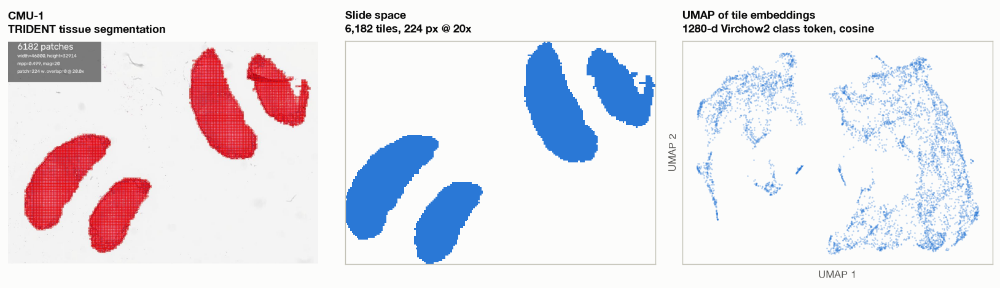
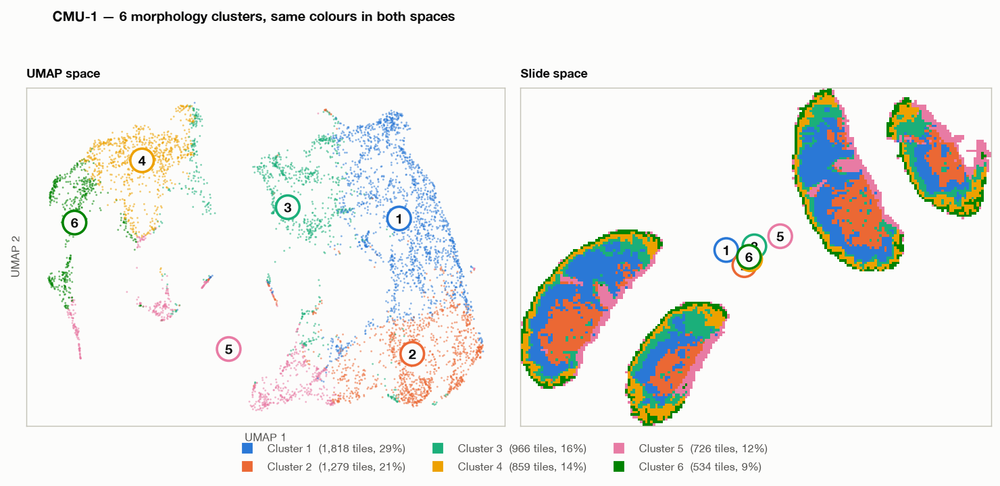
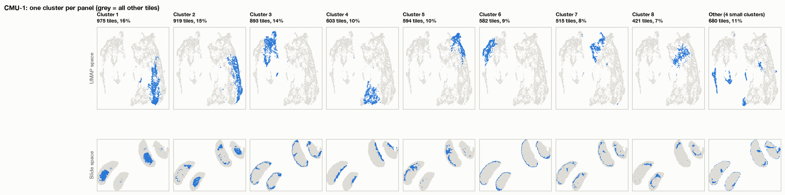
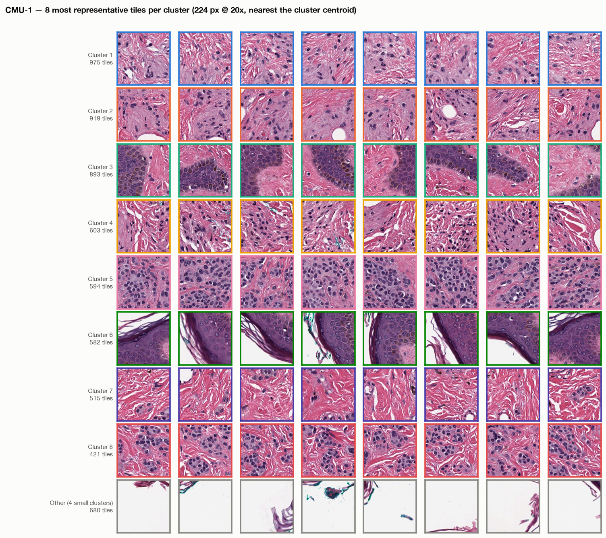
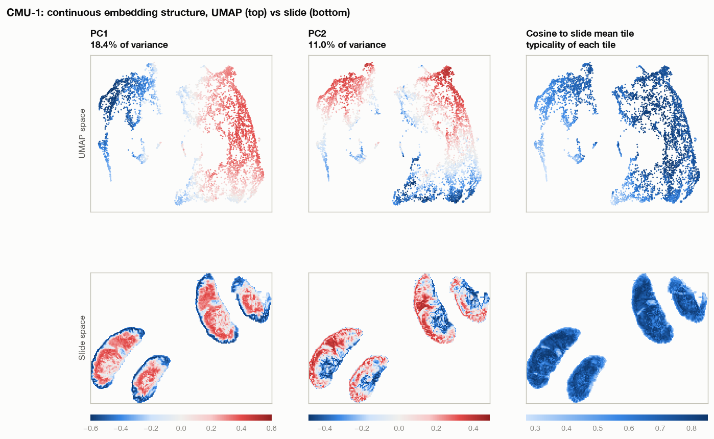
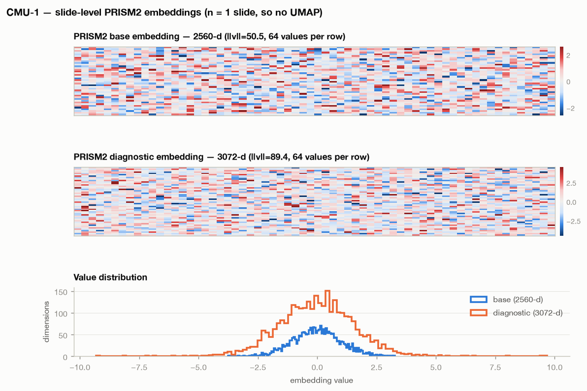

# Tile and slide embeddings from run `nf-prism2-cmu1-gpu-7`

Seqera Platform run `1ZxV1cKkK3M7hP`, status SUCCEEDED, submitted 19 August 2026.
Pipeline commit `dfda462`, executor `awsbatch` on compute environment
`manual-shared-ce-prod-project-ondemand-v13` (NVIDIA A10G). Input: one slide
(CMU-1), question set `questions_test.yaml`, scoring dtype bf16.

This document describes the embedding layers produced by that run and their
projection into UMAP space and slide coordinate space.

## 1. Embedding layers and their availability

The pipeline produces two embedding layers.

| Layer | Shape | Process | Published to `--outdir` |
|---|---|---|---|
| Tile embeddings | 6182 x 1280 | `TRIDENT_EMBED`, Virchow2 class token, 224 px at 20x | No |
| Slide embeddings | `base` 1 x 2560, `diagnostic` 1 x 3072 | `PRISM2_INFER` | Yes, in `prism2/CMU-1/CMU-1.embeddings.npz` |

`TRIDENT_EMBED` declares `publishDir ... pattern: 'qc/*'`. The tile embedding
file `CMU-1.features.h5` (32 MB) is therefore retained only in the task work
directory:

```
s3://mc2-project-tower-scratch/work/64/8f288726701ed9b3929f9274b22512/CMU-1.features.h5
```

All tile-level results below were computed from that file. Its lifetime is bound
to the Seqera scratch work directory. Adding `${meta.id}.features.h5` to the
publish pattern in `modules/local/trident_embed/main.nf` would make the analysis
reproducible from `--outdir` alone. This is recommended, because tile embeddings
are required for clustering, spatial mapping, aggregator development and
tile-level quality control, and no other process in the pipeline regenerates
them without repeating GPU inference.

## 2. Method

Virchow2 class-token embeddings are compared by cosine similarity, so all
vectors were L2-normalised before applying any Euclidean method.

1. PCA to 50 components. Explained variance: PC1 18.4%, PC2 11.0%, PC3 8.8%,
   PC1 to PC10 58.6%.
2. UMAP on the 50 components with `n_neighbors=30`, `min_dist=0.1`, cosine
   metric.
3. Leiden clustering (`RBConfigurationVertexPartition`, resolution 0.5) on the
   fuzzy k-nearest-neighbour graph constructed by UMAP. Using the UMAP graph
   rather than a second independent graph means the partition and the layout
   derive from the same neighbourhood structure. Result: 12 clusters, modularity
   0.754.
4. The 4 smallest clusters were merged into a single "Other" group, giving 9
   rendered groups. The merge avoids assigning categorical colours beyond the
   validated palette.

k-means on the same PCA basis is available via `--cluster kmeans --k N` for
comparison, or where a fixed cluster count across slides is required.

Spatial panels are rendered as rasters on the tile grid (224 px spacing at level
0) rather than as scatter plots, so each mark corresponds to exactly one tile at
its true position and scale.

## 3. Tile distribution before clustering



**Figure 1.** Tile inventory for CMU-1. Left: TRIDENT tissue segmentation
overlay. Centre: positions of all 6182 retained tiles in slide coordinates.
Right: UMAP projection of the 1280-dimensional tile embeddings. Single colour
throughout; no grouping has been applied.

The slide contains four tissue fragments. The UMAP separates into two principal
lobes before any clustering is applied.

## 4. Cluster structure



**Figure 2.** Leiden clusters in UMAP space (left) and slide space (right).
Colours are identical between panels. Each cluster is labelled at its
highest-density point so that identity does not depend on colour alone.



**Figure 3.** The same clusters as small multiples, one cluster per column.
Upper row: UMAP space. Lower row: slide space. Grey marks are all tiles not
assigned to the highlighted cluster. This presentation is used because at most
three categorical colours remain distinguishable under simulated colour-vision
deficiency when every pair of colours may appear adjacent, as in a scatter plot.
Figure 2 is the compact summary; Figure 3 is the version that remains readable
for all viewers.



**Figure 4.** Representative tiles, one row per cluster. For each cluster, the
eight tiles with the highest cosine similarity to the cluster centroid are shown,
cropped from the source slide at 224 px and 20x. Row borders use the same colours
as Figures 2 and 3. Individual crops are written to
`figures/CMU-1.representative_tiles/cluster_NN/`.

Morphology assigned by inspection of the representative tiles in Figure 4:

| Cluster | Tiles | Morphology |
|---|---|---|
| 1 | 975 (16%) | loose spindled dermal stroma with scattered nuclei |
| 2 | 919 (15%) | more cellular spindled stroma, occasional clear spaces |
| 3 | 893 (14%) | glandular or adnexal epithelium, basophilic epithelial lining against eosinophilic stroma |
| 4 | 603 (10%) | fibrous stroma with wispy collagen and small vessels |
| 5 | 594 (10%) | dense sheets of uniform round nuclei, the nested tumour compartment |
| 6 | 582 (9%) | epidermis with overlying keratin |
| 7 | 515 (8%) | dense eosinophilic collagen, nearly acellular |
| 8 | 421 (7%) | tumour nests interleaved with collagen, a mixed morphology |
| Other | 680 (11%) | background glass, section-edge debris, pen and ink fragments |

Two observations follow.

First, the clusters separate morphology rather than stain intensity. Clusters 6
(epidermis with keratin) and 3 (glandular epithelium) are both strongly
basophilic and would not be distinguished by colour-based features, but they
occupy different regions of the UMAP. Cluster 8, which contains both tumour nests
and collagen, is positioned between cluster 5 (tumour) and cluster 7 (collagen)
in both UMAP and slide space, which is the expected behaviour for a mixed tile.

Second, the spatial distribution is concentric. Each of the four fragments shows
the same layering from the margin inward: epidermis and keratin (cluster 6) at
the outer rim, collagen (7) and fibrous stroma (4) beneath it, then stroma
(1, 2), with tumour (5, 8) in the fragment interiors. No stage of the pipeline
uses spatial context; TRIDENT embeds each 224 px tile independently. The
recovered layering therefore derives from tile appearance alone. Recovery of
tissue architecture by a spatially uninformed representation is a useful
validity check to repeat on larger cohorts.

The "Other" group has an operational implication. 680 tiles (11% of the total),
consisting of glass, section-edge debris and ink, passed `--segmenter otsu` at
`--seg_conf_thresh 0.5` and were embedded and passed to PRISM2. On this slide the
effect is 11% additional compute and a small contribution of non-tissue signal to
the slide-level aggregation. On cohorts with pen marks or scanner artefacts,
`--segmenter hest`, `--remove_penmarks` and `--remove_artifacts` should be
evaluated.

## 5. Continuous structure



**Figure 5.** Continuous embedding structure. Columns: PC1 (18.4% of variance),
PC2 (11.0%), and cosine similarity of each tile to the mean tile embedding of the
slide. Upper row: UMAP space. Lower row: slide space. PC1 and PC2 use a diverging
scale centred on zero; cosine similarity uses a sequential scale. Colour limits
are set to the 1st and 99th percentiles.

PC1 reproduces the interior-versus-margin contrast without requiring a cluster
count: values are negative across fragment margins and positive through fragment
interiors. Cosine similarity to the slide mean functions as a typicality measure.
Fragment interiors are typical of the slide, while margins and debris are not,
which provides a tile-level quality control signal.

## 6. Slide-level embeddings



**Figure 6.** PRISM2 slide-level embeddings. Upper two panels: the `base`
(2560-dimensional) and `diagnostic` (3072-dimensional) vectors reshaped to 64
values per row and rendered on a diverging scale centred on zero. Lower panel:
value distributions of both vectors. Vector norms are 50.5 (`base`) and 89.4
(`diagnostic`). Both distributions are approximately zero-centred and unimodal;
`diagnostic` has heavier tails.

A UMAP of the slide-level embeddings cannot be produced from this run. UMAP
requires a population of observations, and n = 1 slide yields a single point. A
slide-level UMAP, which would show whether PRISM2 separates diagnoses, requires
approximately 20 or more slides through the pipeline.

The slide-level embeddings also cannot be projected into the tile UMAP. The tile
space is 1280-dimensional Virchow2 output and the slide space is 2560- or
3072-dimensional PRISM2 output. These are different spaces and the two
projections are not comparable point for point.

## 7. Inconsistency in the run's question answers

This is separate from the visualisation, but the representative tiles are
relevant to it. The run's `CMU-1.prism2.json` reports:

- `invasive_carcinoma` score 0.018
- `cancer_type` open-ended answer: "This is a melanoma."
- `report`: "The examination reveals a compound nevus."

Melanoma and compound nevus are different diagnoses. Separately, "invasive
carcinoma" is not an applicable question for a melanocytic lesion, since melanoma
is not a carcinoma, so the low score may be correct while the question is
inapplicable. The cluster 5 representative tiles (uniform round nuclei in dense
nests, no gland formation) are consistent with a melanocytic lesion but do not
distinguish nevus from melanoma at 20x.

These outputs come from `questions_test.yaml` applied to a single public test
slide with `max_new_tokens 32` and bf16 scoring, so they are a smoke-test
artefact rather than a result. Two actions follow: the question set must match the
tissue type before any score is interpreted, and scoring should be repeated with
`--scoring_dtype fp32` before any yes/no score is treated as calibrated.

## 8. Reproducing

Requires the `openslide` library (Homebrew) plus the `openslide-bin` wheel, and
the source slide for the tile crops in Figure 4. All other inputs come from the
run. Input staging is recorded in `README.md`.

```bash
uv run python bin/visualize_embeddings.py \
  --features    analysis/data/CMU-1.features.h5 \
  --slide-npz   analysis/data/outdir/prism2/CMU-1/CMU-1.embeddings.npz \
  --thumb       analysis/data/outdir/tiles/CMU-1/qc/CMU-1.jpg \
  --prism2-json analysis/data/outdir/prism2/CMU-1/CMU-1.prism2.json \
  --wsi         analysis/data/CMU-1.svs \
  --outdir      analysis/figures
```

`analysis/data/` is excluded from version control; the slide is 169 MB and the
feature file is 32 MB.

### Output files

| File | Contents |
|---|---|
| `figures/CMU-1.01_overview.png` | Figure 1 |
| `figures/CMU-1.02_clusters_umap_spatial.png` | Figure 2 |
| `figures/CMU-1.03_cluster_small_multiples.png` | Figure 3 |
| `figures/CMU-1.06_representative_tiles.png` | Figure 4 |
| `figures/CMU-1.04_continuous.png` | Figure 5 |
| `figures/CMU-1.05_slide_embedding.png` | Figure 6 |
| `figures/CMU-1.representative_tiles/cluster_NN/` | individual tile crops, named `CMU-1_rankNN_x<X>_y<Y>.png` |
| `figures/CMU-1.tile_projection.npz` | tile coordinates, UMAP coordinates, PC1 to PC10, cluster labels, cosine to slide mean |
| `figures/CMU-1.viz_summary.json` | cluster sizes, PC variance ratios, representative tile coordinates, the run's PRISM2 output |

### Runtime

From the run's `pipeline_info/trace.txt`:

| Process | Wall time | Compute time | Peak RSS |
|---|---|---|---|
| `TRIDENT_EMBED (CMU-1)` | 12m 49s | 56.5s | 127.3 GB |
| `PRISM2_INFER (CMU-1)` | 11m 48s | 2m 26s | 12.2 GB |
| `COLLECT_RESULTS` | 6m 39s | 0.3s | 14.3 MB |

Wall time is dominated by AWS Batch scheduling and model staging rather than
inference.
