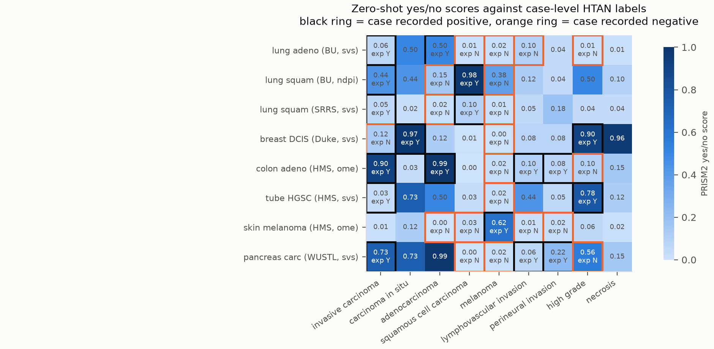
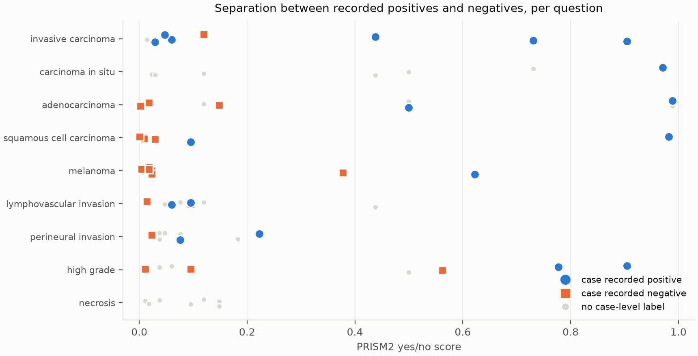
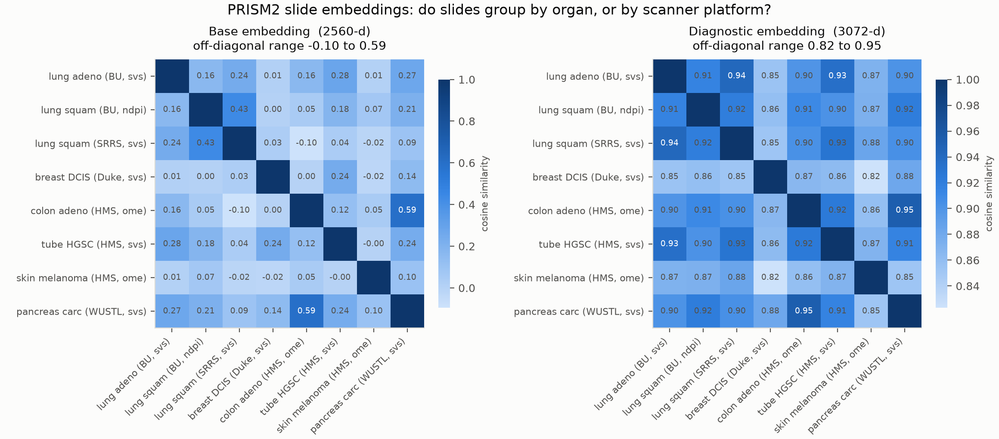
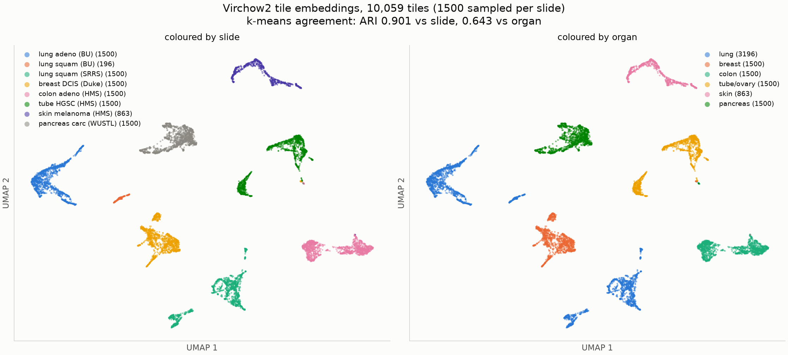

# HTAN 10-slide pilot: results and analysis

Run `nf-prism2-htan10-v2` (Seqera Platform workflow `4m7zf1FiGZeB7U`), 19 Aug 2026,
`nf-prism2` at `66bf01a`, AWS Batch `p4d.24xlarge` with 8 slides packed per instance.
Question set `assets/questions_htan10.yaml`, expected answers `assets/htan10_ground_truth.csv`.

Plain technical English. Everything here is measured, and the limits are stated.

## 1. Pipeline outcome

8 of 10 slides completed the whole chain. 2 were dropped on read, both for file-format reasons
rather than pipeline bugs, and both appeared in `failed_samples.txt`:

| Slide | Exit | Cause |
|---|---|---|
| `DUKE_breast_dcis_tiff` | 1 | Plain `.tiff` that OpenSlide cannot open. TRIDENT selects a reader from the file extension with no probing and no fallback, and `.tiff` maps to OpenSlide. |
| `HTAPP_breast_lobular_svs` | 1 | `Unable to extract MPP from slide metadata`. An svs with no pixel-size tag, so the assumption that Aperio implies MPP is wrong for cleaned or converted files. |

One slide recovered by itself: `HMS_colorectal_adenocarcinoma_ometiff` hit a cgroup OOM (exit 137)
at 24 GB reading a 71708 x 49993 OME-TIFF, and passed on the retry at 48 GB because the resource
labels scale with `task.attempt`. The run exited 0, so the cohort completed with the loss recorded
rather than the whole run failing.

## 2. Throughput, and where the time actually goes

| Stage | Range across slides | What dominates |
|---|---|---|
| `TRIDENT_EMBED` | 143 s to 572 s | tiling and Virchow2, plus about 200 s fixed cost |
| `PRISM2_INFER` | 1380 s to 1918 s | **staging the 17.9 GB slide cache**, for roughly 30 s of compute |

Splitting the model cache per pass was the single biggest win of the day. The previous attempt
staged one 47 GB cache into every task and no tile task had finished by 2000 s. With a
`tile_cache` of 3.09 GB the same tile passes complete in 143 to 572 s.

The remaining problem is the slide pass. 17.9 GB of PRISM2 weights are staged per slide to run
about 30 s of inference, which is 98 percent overhead. Options, in order of expected value:
bake the weights into the image, hold one process open across many slides, or mount rather
than copy. Until that is fixed, per-slide cost on Batch is dominated by transfer, not GPU.

## 3. Tile counts, and which estimator to trust

118,263 tiles across the 8 slides, mean 14,783 per slide, which supports the ~15k figure behind
the cohort cost extrapolation in `BENCHMARK_PLAN.md`.

| Slide | Actual tiles | From geometry | From file size |
|---|---|---|---|
| colon adeno (HMS, ome) | 58,331 | 6,209 | 29,996 |
| breast DCIS (Duke, svs) | 25,955 | 54 | 16,461 |
| lung adeno (BU, svs) | 20,460 | 13,398 | 39,140 |
| lung squam (SRRS, svs) | 5,487 | not in BigQuery | not in BigQuery |
| tube HGSC (HMS, svs) | 4,732 | 5,414 | 44,627 |
| pancreas carc (WUSTL, svs) | 2,239 | 2,012 | 3,292 |
| skin melanoma (HMS, ome) | 863 | 168 | 1,097 |
| lung squam (BU, ndpi) | 196 | metadata junk | 732 |

Geometry from `imaging_level2_metadata_current` is accurate **when the recorded SizeX and SizeY
are the full-resolution level** (tube HGSC within 1.14x, pancreas within 1.11x). It is
catastrophically wrong when they are a pyramid tier: the Duke slide records 11264 x 11264 at
0.161 mpp, which is a 1.8 mm field, and the true count is 25,955. There is no flag in the
metadata to tell these apart, so **treat BigQuery pixel dimensions as a lower bound, and expect
file size to be the better predictor for Aperio-style svs**.

The QC overlays also show the collection is heterogeneous in a way the metadata does not
advertise: the BU `ndpi` is a single small core (16384 x 12800, 196 tiles), the HMS ovarian
slide is an 80x scan of five separate tissue fragments, and the HMS OME-TIFFs are ROI strips
from the Orion platform whose colour rendering differs visibly from conventional H&E.

## 4. Diagnostic agreement

**Forced choice is close to perfect.**

| Probe | Result |
|---|---|
| `primary_site_mc` | **8 of 8** correct |
| open-ended primary site | **8 of 8** correct, including "the fallopian tube" for the HGSC case, matching the metadata rather than the looser "ovary" |
| `histologic_type_mc` | **7 of 8** exact. The pancreas slide answered "invasive adenocarcinoma" where HTAN records "pancreatobiliary-type carcinoma", which is a vocabulary difference, not an error |

**Open-ended type** was precise on 6 of 8 and correct-but-broader on 2, answering "non-small cell
lung cancer" for a lung adenocarcinoma and "non-small cell carcinoma" for a squamous case. Note
that the forced-choice answer for that same squamous slide was correct, so constraining the
vocabulary recovered the specificity.

## 5. Zero-shot yes/no scores

Rank agreement against the case-level labels, computed as the probability that a recorded
positive outscores a recorded negative:

| Question | n+ | n- | AUC | min(pos) | max(neg) | Reading |
|---|---|---|---|---|---|---|
| adenocarcinoma | 2 | 3 | 1.00 | 0.500 | 0.148 | perfect ranking |
| squamous cell carcinoma | 2 | 3 | 1.00 | 0.095 | 0.029 | perfect ranking |
| melanoma | 1 | 7 | 1.00 | 0.622 | 0.378 | perfect ranking |
| high grade | 2 | 3 | 1.00 | 0.777 | 0.562 | perfect ranking |
| perineural invasion | 2 | 1 | 1.00 | 0.076 | 0.023 | n far too small to mean anything |
| lymphovascular invasion | 2 | 2 | 0.62 | 0.060 | 0.095 | no useful separation |
| invasive carcinoma | 6 | 1 | 0.50 | 0.029 | 0.119 | no separation |
| carcinoma in situ | 1 | 0 | n/a | 0.971 | - | only positives labelled |

Three things follow.

**Ranking works where absolute values do not.** The SRRS squamous case scored 0.095 and was still
correctly ranked above every recorded negative, the highest of which was 0.029. Thresholding at
0.5 would have called it negative. Use these as continuous features or ranks, never as binary
calls at a fixed cut.

**In situ versus invasive is the clearest single signal.** The Duke DCIS slide scored 0.971 on
carcinoma in situ and 0.119 on invasive carcinoma, while the invasive cases sat at 0.02 to 0.03
on in situ. The `invasive_carcinoma` question fails in the other direction: three genuinely
invasive cases scored 0.029 to 0.060, below the one in-situ case. The model appears to answer
"is there frank invasive tumour in this section" rather than "does this case have an invasive
diagnosis", which is a reasonable thing for it to do and a bad match for a case-level label.

**Lymphovascular invasion shows nothing.** Recorded positives scored 0.060 and 0.095, recorded
negatives 0.014 and 0.095. Either the model cannot see it, or a case-level LVI flag does not
apply to the section on this slide. This pilot cannot distinguish those, and it would be wrong to
report either conclusion. Perineural invasion ranked correctly but with two positives and one
negative, which is not evidence.

## 6. bf16 quantisation, confirmed at scale

72 scores across 8 slides and 9 questions collapse onto **32 distinct values**. The value 0.0953
appears 5 times, 0.1192 5 times, 0.5 four times. These are independent measurements on different
slides landing on the same bf16 grid points.

This is the artefact predicted from the single-slide CMU-1 run, now visible across a cohort. Any
AUC or calibration curve computed from bf16 scores is partly measuring the dtype. `--scoring_dtype
fp32` exists for this and remains untested on a GPU. It should be run before any quantitative
yes/no result is reported.

## 7. Slide embeddings: base is a usable retrieval space, diagnostic is not

Cosine similarity between the 8 slides. Note the panels use different colour scales by necessity,
and the difference in dynamic range is itself the finding.

**Base embedding (2560-d), off-diagonal range 0.00 to 0.59.** Well spread and biologically
sensible:

* The two highest pairs are **colon adenocarcinoma and pancreatobiliary carcinoma at 0.59**, and
  **the two squamous lung slides at 0.43**. Both pairs cross centres, and the second crosses file
  formats (ndpi against svs) as well. Morphology is driving the space, not provenance.
* The two HMS OME-TIFF slides, same centre and same Orion platform, sit at **0.05**. So there is
  no obvious platform clustering, which is the batch effect we most feared for a searchable
  resource.
* Melanoma is nearly orthogonal to everything (maximum 0.10), as its morphology implies.

**Diagnostic embedding (3072-d), off-diagonal range 0.82 to 0.95.** The ordering is broadly the
same, with colon and pancreas again highest at 0.95, but everything is compressed into a narrow
band. That is expected for a decoder hidden state at the assistant token, which shares most of
its structure across inputs.

**Consequence for Aim 1.5.** Cosine search over the base embedding is the right primitive. The
diagnostic embedding is a poor choice for nearest-neighbour retrieval despite being larger and
later in the network. It may still serve linear probes, where a classifier can exploit small
differences that cosine distance washes out, and that is worth testing separately.

## 7b. Tile embeddings separate by slide, not by organ

10,059 tiles, 1,500 sampled per slide so a 58,000-tile slide cannot dominate the projection.
PCA to 50 components, then UMAP on cosine distance. k-means agreement with the labels, using the
metrics Epic 4 names:

| Partition | k | Adjusted Rand | macro F1 | macro Jaccard |
|---|---|---|---|---|
| by slide | 8 | **0.901** | 0.831 | 0.799 |
| by organ | 6 | 0.643 | 0.862 | 0.798 |

Every slide forms its own island, and the three lung slides sit in three separate, distant
regions rather than merging. So **at tile level, slide identity is a stronger signal than organ
identity**, which is the opposite of what the slide-level embedding showed in section 7.

This is coherent rather than contradictory. PRISM2's Perceiver aggregates thousands of tiles into
one vector and in doing so abstracts away slide-specific texture, leaving morphology. Raw Virchow2
tile embeddings retain that texture, which includes stain, scanner and section-preparation
signature.

Two caveats on how far this can be pushed. Slide and organ are largely confounded here, because
only lung has more than one slide. And the three lung slides differ in centre, scanner, container
format, specimen type (one is a small core, one a resection) and diagnosis all at once, so the
separation cannot be attributed to stain batch alone from this design.

**The consequence for Aim 1.5 is concrete and testable.** Nearest neighbours of a query tile will
preferentially come from the same slide. An image search tool built on raw tile embeddings will
tend to return "more of the slide you just queried" rather than morphologically similar regions
from other patients, which is precisely the failure the rank-stability and cross-centre tests in
`BENCHMARK_PLAN.md` exist to catch. Practical options: exclude same-slide hits at query time,
normalise per slide before indexing, or search the aggregated slide space and drill down. This
should be measured on the designed contrast set, where the same tissue type appears across
centres, before the search tool is built on top.

## 8. Generated text is not trustworthy on its own

The clearest example: `SRRS_lung_squamous_svs` answered "squamous cell carcinoma" on forced
choice, "non-small cell carcinoma" open-ended, and its report says **"The specimen is negative for
tumor."** One slide, one forward pass, three mutually inconsistent statements.

Two other answers are interesting and cannot be adjudicated here:

* The ovarian slide returned "serous tubal intraepithelial carcinoma" with a very low invasive
  score. STIC is the fallopian tube precursor of high-grade serous carcinoma, the metadata records
  the site as fallopian tube, and the QC overlay shows tubal-looking fragments. This may be a
  correct read of this section against a case-level HGSC label.
* The BU lung slide returned "a small focus of atypical pneumocyte proliferation" for a case
  recorded as G1, Stage IA1 adenocarcinoma. Plausibly a precise description of early disease.
* The Duke DCIS slide scored **0.96 on necrosis**, which has no label. High-grade DCIS with comedo
  necrosis is common, so this may be a true positive that our metadata simply does not record.

All three need a pathologist. They are the kind of thing the Epic 7 validation log exists for.

## 9. What this changes

1. **Use the base embedding for the vector database**, not the diagnostic embedding.
2. **Run fp32 scoring before reporting any yes/no metric.** The grid artefact is now measured.
3. **Do not trust generated reports without the paired score**, and never publish them as
   findings without human review.
4. **Case-level labels cannot validate section-level questions** such as invasive carcinoma and
   lymphovascular invasion. For those, the TIL-annotated set with real spatial ground truth, or a
   pathologist read of these actual slides, is required.
5. **Fix slide-pass staging** before any cohort run. 1380 to 1918 s per slide for 30 s of compute
   makes the current per-slide cost transfer-bound.
6. **Treat BigQuery pixel dimensions as a lower bound** when planning tile counts and cost.
7. **Do not build tile-level cosine search without a same-slide control.** Tile embeddings cluster
   by slide at ARI 0.90, so unconstrained nearest-neighbour search will return same-slide tiles.
8. **Publish tile embeddings.** Aim 1.4 promises them in BigQuery, and the pipeline currently
   keeps them only in the work directory. Added as `--publish_tile_features`, off by default
   because it is about 630 MB per 10 slides, so roughly 137 GB across the full collection.

## Files

| File | Contents |
|---|---|
| `results.tsv`, `results.json` | pipeline output, 8 slides |
| `failed_samples.txt` | the 2 dropped slides |
| `embeddings/*.npz` | base (2560-d) and diagnostic (3072-d) per slide |
| `figures/` | the three figures above |
| `make_figures.py` | regenerates figures 1 to 3; palette validated with the dataviz validator |
| `make_tile_figures.py` | tile-level UMAP and cluster purity (figure 4) |
| `tile_clustering_metrics.json` | the ARI, F1 and Jaccard numbers above |
