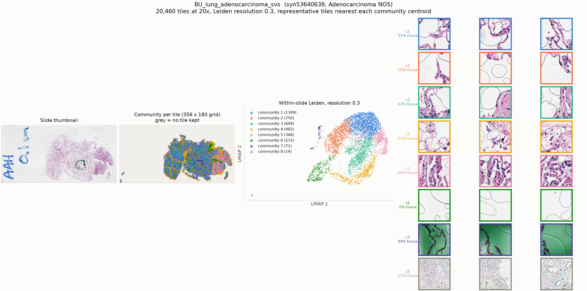

# BU_lung_adenocarcinoma_svs

* Synapse: [`syn53640639`](https://www.synapse.org/#!Synapse:syn53640639)
* HTAN participant: `HTA3_80014`
* Tiles at 20x: **20,460**, level-0 79680 x 40110, tile 224 px at level 0
* Leiden communities (resolution 0.3): **8**, largest 8 shown

## HTAN metadata against the PRISM2 answer

| Field | HTAN records | PRISM2 answered | Verdict |
|---|---|---|---|
| Primary site / organ | Lung NOS | The primary site or organ of origin is the lung.  |  MC: A. Lung | agree |
| Diagnosis / histologic type | Adenocarcinoma NOS | This is a non-small cell lung cancer.  |  MC: A. Invasive adenocarcinoma | agree |
| Tumour grade | G1 | The tumor is classified as low grade.  |  high grade score: 0.011 | compare by hand |
| Lymphovascular invasion | no | score 0.095 | compare the score against the label by hand |
| Perineural invasion | _not recorded_ | score 0.037 | no HTAN label |
| Pathologic stage | Stage IA1 | not asked | not asked |
| Breslow thickness | _not recorded_ | not asked | not asked |

Verdicts are deliberately conservative and based on string matching, and the HTAN
labels are **case-level**, so a disagreement is not necessarily a model error.

## Generated report

> The sample shows a small focus of atypical pneumocyte proliferation.

## All yes/no scores

| Question | Score |
|---|---|
| Is invasive carcinoma present? | 0.060 |
| Is carcinoma in situ present? | 0.500 |
| Is adenocarcinoma present? | 0.500 |
| Is squamous cell carcinoma present? | 0.009 |
| Is malignant melanoma present? | 0.018 |
| Is lymphovascular invasion present? | 0.095 |
| Is perineural invasion present? | 0.037 |
| Is the tumor high grade? | 0.011 |
| Is tumor necrosis present? | 0.011 |
