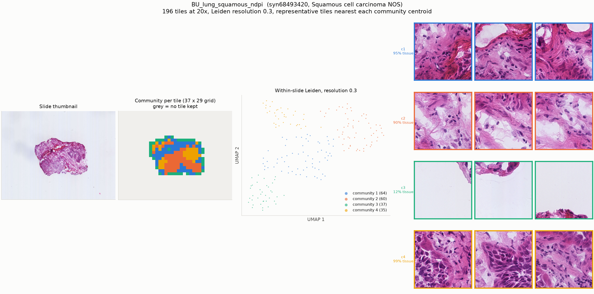

# BU_lung_squamous_ndpi

* Synapse: [`syn68493420`](https://www.synapse.org/#!Synapse:syn68493420)
* HTAN participant: `HTA3_70153`
* Tiles at 20x: **196**, level-0 16384 x 12800, tile 448 px at level 0
* Leiden communities (resolution 0.3): **4**, largest 8 shown

## HTAN metadata against the PRISM2 answer

| Field | HTAN records | PRISM2 answered | Verdict |
|---|---|---|---|
| Primary site / organ | Lung NOS | The primary site or organ of origin is the lung.  |  MC: A. Lung | agree |
| Diagnosis / histologic type | Squamous cell carcinoma NOS | This is a squamous cell carcinoma.  |  MC: B. Squamous cell carcinoma | agree |
| Tumour grade | _not recorded_ | The tumor is classified as high grade.  |  high grade score: 0.500 | no HTAN label |
| Lymphovascular invasion | _not recorded_ | score 0.119 | no HTAN label |
| Perineural invasion | _not recorded_ | score 0.037 | no HTAN label |
| Pathologic stage | _not recorded_ | not asked | not asked |
| Breslow thickness | _not recorded_ | not asked | not asked |

Verdicts are deliberately conservative and based on string matching, and the HTAN
labels are **case-level**, so a disagreement is not necessarily a model error.

## Generated report

> Squamous cell carcinoma is present.

## All yes/no scores

| Question | Score |
|---|---|
| Is invasive carcinoma present? | 0.438 |
| Is carcinoma in situ present? | 0.438 |
| Is adenocarcinoma present? | 0.148 |
| Is squamous cell carcinoma present? | 0.982 |
| Is malignant melanoma present? | 0.378 |
| Is lymphovascular invasion present? | 0.119 |
| Is perineural invasion present? | 0.037 |
| Is the tumor high grade? | 0.500 |
| Is tumor necrosis present? | 0.095 |
