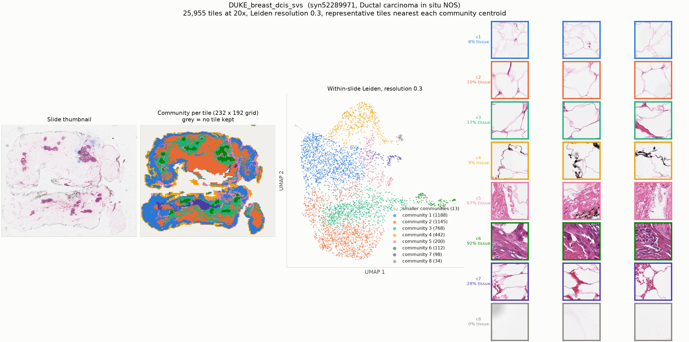

# DUKE_breast_dcis_svs

* Synapse: [`syn52289971`](https://www.synapse.org/#!Synapse:syn52289971)
* HTAN participant: `HTA6_2411`
* Tiles at 20x: **25,955**, level-0 51792 x 42907, tile 224 px at level 0
* Leiden communities (resolution 0.3): **9**, largest 8 shown

## HTAN metadata against the PRISM2 answer

| Field | HTAN records | PRISM2 answered | Verdict |
|---|---|---|---|
| Primary site / organ | Breast NOS | The primary site or organ of origin is the breast.  |  MC: B. Breast | agree |
| Diagnosis / histologic type | Ductal carcinoma in situ NOS | This is a case of ductal carcinoma in situ (DCIS).  |  MC: C. Ductal carcinoma in situ | agree |
| Tumour grade | G3 | The tumor is classified as high grade.  |  high grade score: 0.905 | compare by hand |
| Lymphovascular invasion | _not recorded_ | score 0.076 | no HTAN label |
| Perineural invasion | _not recorded_ | score 0.076 | no HTAN label |
| Pathologic stage | _not recorded_ | not asked | not asked |
| Breslow thickness | _not recorded_ | not asked | not asked |

Verdicts are deliberately conservative and based on string matching, and the HTAN
labels are **case-level**, so a disagreement is not necessarily a model error.

## Generated report

> Ductal carcinoma in situ (DCIS) is present.

## All yes/no scores

| Question | Score |
|---|---|
| Is invasive carcinoma present? | 0.119 |
| Is carcinoma in situ present? | 0.971 |
| Is adenocarcinoma present? | 0.119 |
| Is squamous cell carcinoma present? | 0.005 |
| Is malignant melanoma present? | 0.004 |
| Is lymphovascular invasion present? | 0.076 |
| Is perineural invasion present? | 0.076 |
| Is the tumor high grade? | 0.905 |
| Is tumor necrosis present? | 0.963 |
