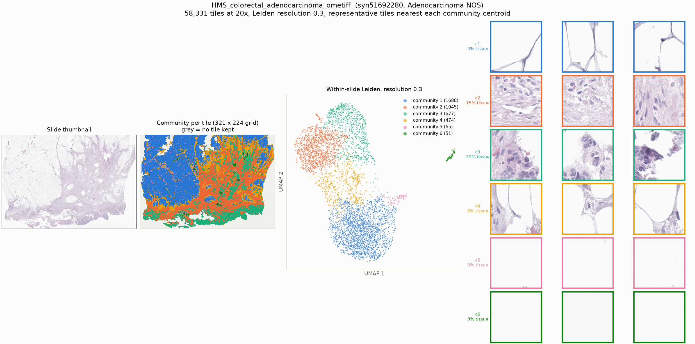

# HMS_colorectal_adenocarcinoma_ometiff

* Synapse: [`syn51692280`](https://www.synapse.org/#!Synapse:syn51692280)
* HTAN participant: `HTA7_989`
* Tiles at 20x: **58,331**, level-0 71708 x 49993, tile 224 px at level 0
* Leiden communities (resolution 0.3): **6**, largest 8 shown

## HTAN metadata against the PRISM2 answer

| Field | HTAN records | PRISM2 answered | Verdict |
|---|---|---|---|
| Primary site / organ | Transverse colon | The primary site or organ of origin is the colon.  |  MC: C. Colon or rectum | agree |
| Diagnosis / histologic type | Adenocarcinoma NOS | This is a case of adenocarcinoma.  |  MC: A. Invasive adenocarcinoma | agree |
| Tumour grade | Low Grade | The tumor is classified as Grade 2.  |  high grade score: 0.095 | compare by hand |
| Lymphovascular invasion | yes | score 0.095 | compare the score against the label by hand |
| Perineural invasion | yes | score 0.076 | compare the score against the label by hand |
| Pathologic stage | Stage IVC | not asked | not asked |
| Breslow thickness | _not recorded_ | not asked | not asked |

Verdicts are deliberately conservative and based on string matching, and the HTAN
labels are **case-level**, so a disagreement is not necessarily a model error.

## Generated report

> The specimen shows a moderately differentiated adenocarcinoma of enteric type.

## All yes/no scores

| Question | Score |
|---|---|
| Is invasive carcinoma present? | 0.905 |
| Is carcinoma in situ present? | 0.029 |
| Is adenocarcinoma present? | 0.989 |
| Is squamous cell carcinoma present? | 0.001 |
| Is malignant melanoma present? | 0.023 |
| Is lymphovascular invasion present? | 0.095 |
| Is perineural invasion present? | 0.076 |
| Is the tumor high grade? | 0.095 |
| Is tumor necrosis present? | 0.148 |
