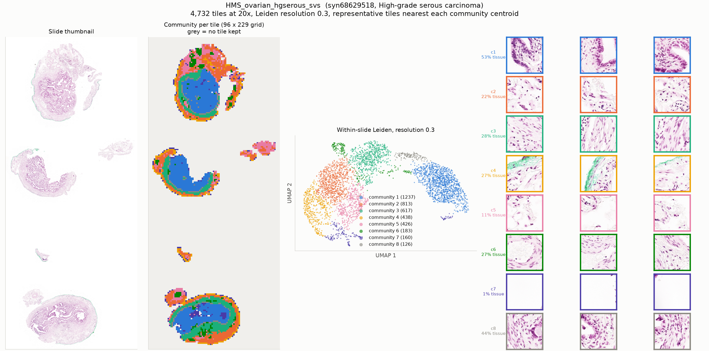

# HMS_ovarian_hgserous_svs

* Synapse: [`syn68629518`](https://www.synapse.org/#!Synapse:syn68629518)
* HTAN participant: `HTA7_1258`
* Tiles at 20x: **4,732**, level-0 86016 x 204800, tile 896 px at level 0
* Leiden communities (resolution 0.3): **8**, largest 8 shown

## HTAN metadata against the PRISM2 answer

| Field | HTAN records | PRISM2 answered | Verdict |
|---|---|---|---|
| Primary site / organ | Fallopian tube | The primary site or organ of origin is the fallopian tube.  |  MC: F. Ovary or fallopian tube | agree |
| Diagnosis / histologic type | High-grade serous carcinoma | This is a serous tubal intraepithelial carcinoma.  |  MC: F. High-grade serous carcinoma | agree |
| Tumour grade | _not recorded_ | The tumor is classified as high grade.  |  high grade score: 0.777 | no HTAN label |
| Lymphovascular invasion | _not recorded_ | score 0.438 | no HTAN label |
| Perineural invasion | _not recorded_ | score 0.047 | no HTAN label |
| Pathologic stage | Stage IC | not asked | not asked |
| Breslow thickness | _not recorded_ | not asked | not asked |

Verdicts are deliberately conservative and based on string matching, and the HTAN
labels are **case-level**, so a disagreement is not necessarily a model error.

## Generated report

> Adenocarcinoma in situ is present in the sample.

## All yes/no scores

| Question | Score |
|---|---|
| Is invasive carcinoma present? | 0.029 |
| Is carcinoma in situ present? | 0.731 |
| Is adenocarcinoma present? | 0.500 |
| Is squamous cell carcinoma present? | 0.029 |
| Is malignant melanoma present? | 0.023 |
| Is lymphovascular invasion present? | 0.438 |
| Is perineural invasion present? | 0.047 |
| Is the tumor high grade? | 0.777 |
| Is tumor necrosis present? | 0.119 |
