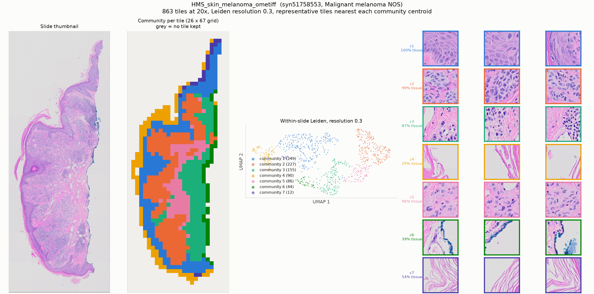

# HMS_skin_melanoma_ometiff

* Synapse: [`syn51758553`](https://www.synapse.org/#!Synapse:syn51758553)
* HTAN participant: `HTA7_6`
* Tiles at 20x: **863**, level-0 5726 x 14865, tile 224 px at level 0
* Leiden communities (resolution 0.3): **7**, largest 8 shown

## HTAN metadata against the PRISM2 answer

| Field | HTAN records | PRISM2 answered | Verdict |
|---|---|---|---|
| Primary site / organ | Skin of scalp and neck | The primary site or organ of origin is the skin.  |  MC: D. Skin | agree |
| Diagnosis / histologic type | Malignant melanoma NOS | This is a melanoma.  |  MC: E. Malignant melanoma | agree |
| Tumour grade | _not recorded_ | The tumor is classified as low grade.  |  high grade score: 0.060 | no HTAN label |
| Lymphovascular invasion | no | score 0.014 | compare the score against the label by hand |
| Perineural invasion | no | score 0.023 | compare the score against the label by hand |
| Pathologic stage | _not recorded_ | not asked | not asked |
| Breslow thickness | 1.2 | not asked | not asked |

Verdicts are deliberately conservative and based on string matching, and the HTAN
labels are **case-level**, so a disagreement is not necessarily a model error.

## Generated report

> The specimen shows a compound melanocytic proliferation with atypical features.

## All yes/no scores

| Question | Score |
|---|---|
| Is invasive carcinoma present? | 0.014 |
| Is carcinoma in situ present? | 0.119 |
| Is adenocarcinoma present? | 0.002 |
| Is squamous cell carcinoma present? | 0.029 |
| Is malignant melanoma present? | 0.622 |
| Is lymphovascular invasion present? | 0.014 |
| Is perineural invasion present? | 0.023 |
| Is the tumor high grade? | 0.060 |
| Is tumor necrosis present? | 0.018 |
