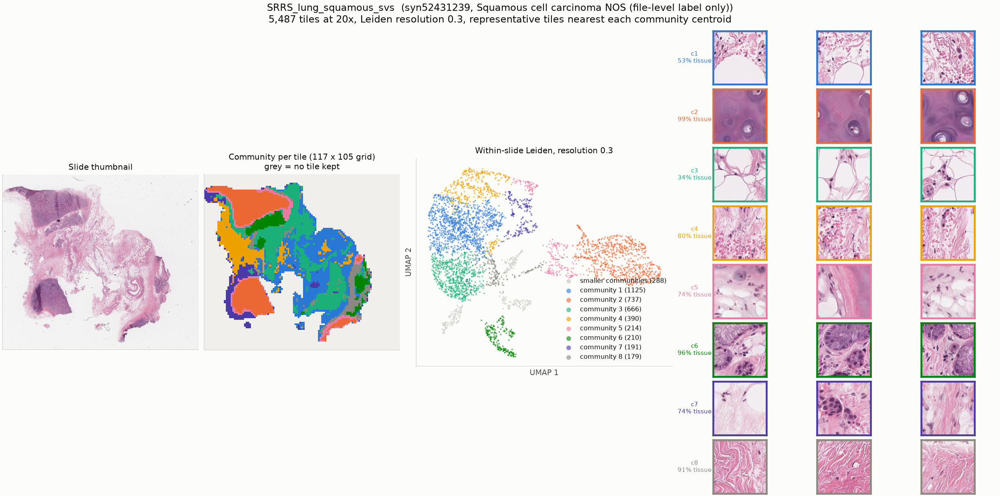

# SRRS_lung_squamous_svs

* Synapse: [`syn52431239`](https://www.synapse.org/#!Synapse:syn52431239)
* HTAN participant: `HTA15_30001`
* Tiles at 20x: **5,487**, level-0 52360 x 46709, tile 448 px at level 0
* Leiden communities (resolution 0.3): **11**, largest 8 shown

## HTAN metadata against the PRISM2 answer

| Field | HTAN records | PRISM2 answered | Verdict |
|---|---|---|---|
| Primary site / organ | Lung | The primary site or organ of origin is the lung.  |  MC: A. Lung | agree |
| Diagnosis / histologic type | Squamous cell carcinoma NOS (file-level label only) | This is a non-small cell carcinoma.  |  MC: B. Squamous cell carcinoma | agree |
| Tumour grade | _not recorded_ | The tumor is classified as grade 2.  |  high grade score: 0.037 | no HTAN label |
| Lymphovascular invasion | _not recorded_ | score 0.047 | no HTAN label |
| Perineural invasion | _not recorded_ | score 0.182 | no HTAN label |
| Pathologic stage | _not recorded_ | not asked | not asked |
| Breslow thickness | _not recorded_ | not asked | not asked |

Verdicts are deliberately conservative and based on string matching, and the HTAN
labels are **case-level**, so a disagreement is not necessarily a model error.

## Generated report

> The specimen is negative for tumor.

## All yes/no scores

| Question | Score |
|---|---|
| Is invasive carcinoma present? | 0.047 |
| Is carcinoma in situ present? | 0.023 |
| Is adenocarcinoma present? | 0.018 |
| Is squamous cell carcinoma present? | 0.095 |
| Is malignant melanoma present? | 0.011 |
| Is lymphovascular invasion present? | 0.047 |
| Is perineural invasion present? | 0.182 |
| Is the tumor high grade? | 0.037 |
| Is tumor necrosis present? | 0.037 |
