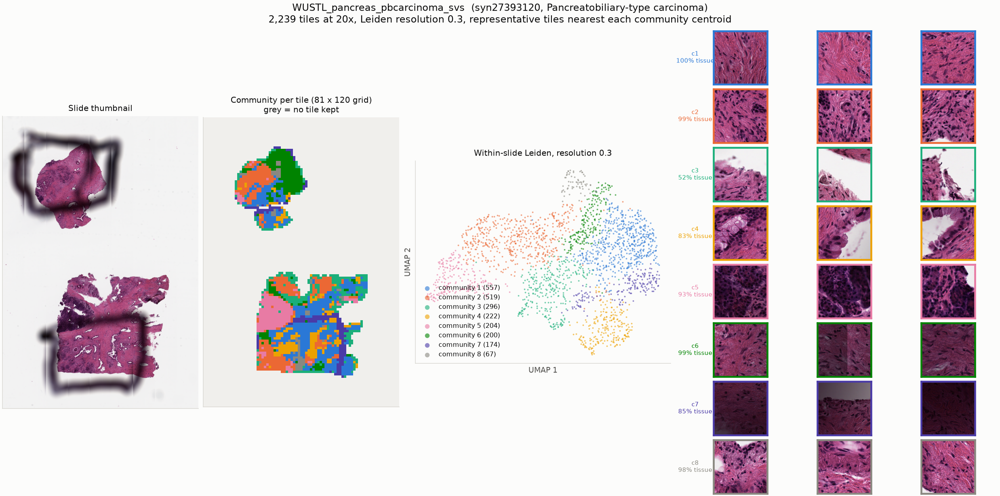

# WUSTL_pancreas_pbcarcinoma_svs

* Synapse: [`syn27393120`](https://www.synapse.org/#!Synapse:syn27393120)
* HTAN participant: `HTA12_16`
* Tiles at 20x: **2,239**, level-0 17928 x 26806, tile 224 px at level 0
* Leiden communities (resolution 0.3): **8**, largest 8 shown

## HTAN metadata against the PRISM2 answer

| Field | HTAN records | PRISM2 answered | Verdict |
|---|---|---|---|
| Primary site / organ | Pancreas NOS | The primary site or organ of origin is the pancreas.  |  MC: E. Pancreas | agree |
| Diagnosis / histologic type | Pancreatobiliary-type carcinoma | This is a case of adenocarcinoma.  |  MC: A. Invasive adenocarcinoma | compare by hand |
| Tumour grade | G1 | The tumor is classified as high grade.  |  high grade score: 0.562 | compare by hand |
| Lymphovascular invasion | Yes | score 0.060 | compare the score against the label by hand |
| Perineural invasion | Yes | score 0.223 | compare the score against the label by hand |
| Pathologic stage | _not recorded_ | not asked | not asked |
| Breslow thickness | _not recorded_ | not asked | not asked |

Verdicts are deliberately conservative and based on string matching, and the HTAN
labels are **case-level**, so a disagreement is not necessarily a model error.

## Generated report

> Adenocarcinoma is present.

## All yes/no scores

| Question | Score |
|---|---|
| Is invasive carcinoma present? | 0.731 |
| Is carcinoma in situ present? | 0.731 |
| Is adenocarcinoma present? | 0.989 |
| Is squamous cell carcinoma present? | 0.001 |
| Is malignant melanoma present? | 0.018 |
| Is lymphovascular invasion present? | 0.060 |
| Is perineural invasion present? | 0.223 |
| Is the tumor high grade? | 0.562 |
| Is tumor necrosis present? | 0.148 |
