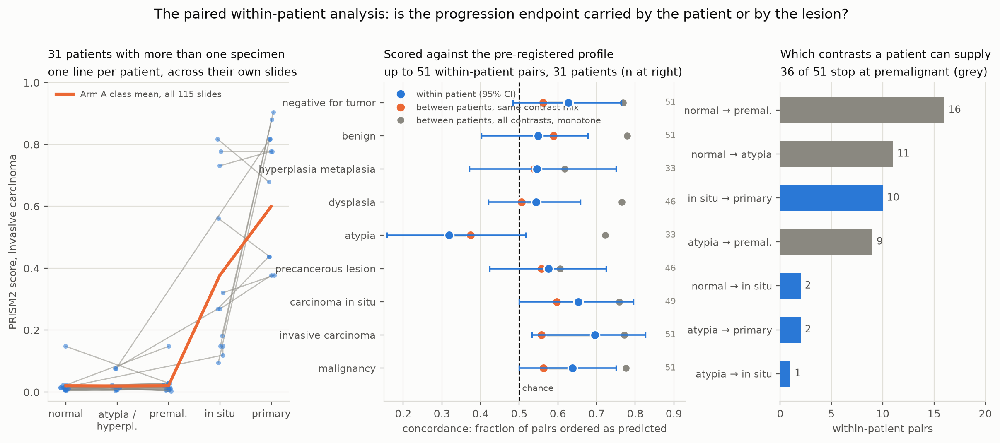

# HTAN progression cohort: results

Run `nf-prism2-progression-188-resume` (`20zEYRdNeMfjuM`), 20 Aug 2026, `nf-prism2` at `160fb4b`,
spot `p4d.24xlarge`, plus 12 slides recovered by `nf-prism2-progression-retry25c`.
**175 slides scored, 134 patients**, merged in `results_merged.json`. Both runs used the same
question set, the same bf16 scoring and the same pinned model revision, so they are directly
comparable; the merge changed no conclusion and tightened several. Scoring follows
`assets/questions_htan_progression.md`, fixed before the run.

**Read Arm A for the progression endpoint.** Arm A is HTAN BU lung, 115 slides and 74 patients
with all six classes, one centre and one organ, which is what removes the scanner and stain
confound. Arm B is a separate replication. Arm C is primary-only across organs and is never
pooled into the progression statistics, for a reason given in section 2b.

## Headline

Asked in pathology report language, PRISM2 tracks the HTAN progression axis closely. Asked the
same question in HTAN's curation vocabulary, it does not. That contrast is the main result.

## 1. The yes/no ladder works

**Arm A**, Spearman against the ordinal axis, 95% CI bootstrapped over **patients** (31 of the
134 scored patients contribute more than one specimen, so slide-level resampling would overstate
precision):

| Question | rho | 95% CI | Observed peak | Predicted |
|---|---|---|---|---|
| `benign` | **-0.65** | -0.76 to -0.52 | normal adjacent | falls, yes |
| `negative_for_tumor` | **-0.64** | -0.75 to -0.50 | atypia | falls, yes |
| `carcinoma_in_situ` | +0.64 | 0.54 to 0.72 | **in situ** | peaks at in situ, **yes** |
| `dysplasia` | +0.64 | 0.52 to 0.73 | in situ | peaks mid, yes |
| `invasive_carcinoma` | +0.65 | 0.52 to 0.75 | primary | rises, yes |
| `malignancy` | +0.65 | 0.53 to 0.75 | primary | rises, yes |
| `atypia` | +0.52 | 0.39 to 0.64 | primary | peaks early, no |
| `hyperplasia_metaplasia` | +0.29 | 0.15 to 0.43 | in situ | peaks early, no |
| `precancerous_lesion` | +0.27 | 0.15 to 0.39 | in situ | peaks mid, weakly |

Six of nine behaved as pre-registered. The one that matters most is `carcinoma_in_situ`: it rises
through the precancer classes, **peaks at carcinoma in situ, then falls again for invasive
disease**. A model with a single "abnormality" axis cannot do that. It implies a lesion-type
distinction, which is what makes these scores worth using as features rather than as a detector.

`hyperplasia_metaplasia` and `atypia` did not peak where predicted, and both are weak. The most
likely reason is that both terms describe changes that persist alongside carcinoma rather than
being replaced by it, so a monotone reading is not obviously wrong.

## 2. Normal versus invasive primary

The endpoint the 10-slide pilot could not compute, having had 6 positives and 1 negative and
returned AUC 0.50. **Arm A**, n+ = 18 invasive primaries against n- = 35 normal and normal
adjacent, all HTAN BU lung:

| Question | AUC | Tied pairs |
|---|---|---|
| `invasive_carcinoma` | **0.998** | 0.0% |
| `malignancy` | **0.998** | 0.2% |
| `carcinoma_in_situ` | 0.970 | 1.0% |
| `negative_for_tumor` | 0.002, that is **0.998** in its own direction | 0.0% |

Separation within a single centre and organ is essentially complete.

### 2b. Why pooling makes this look worse, and what that says about the label

Pooling Arm C drops `invasive_carcinoma` from 0.998 to 0.834 and `carcinoma_in_situ` from 0.970
to 0.857, while inflating the Spearman values (`negative_for_tumor` goes from -0.65 to -0.78)
because 34 extra strongly separated primaries pile up at the top of the axis. Both movements are
artefacts of pooling, in opposite directions.

The AUC drop has a specific cause worth recording. **`TumorTissueType = Primary` means "this is
the primary tumour specimen", not "this tissue is invasive."** Arm C's primaries include Duke
breast DCIS cases, which are primary specimens that are morphologically in situ. When the model
scores those low on `invasive_carcinoma` it is correct and the label is what misleads. Anyone
using `TumorTissueType` as an invasiveness label will silently inherit this.

Arm B replicates the axis directionally in a different organ and centre, rho -0.89 for
`negative_for_tumor` to +0.84 for `carcinoma_in_situ`. Its AUCs are 0.955 to 1.000 but rest on
**2 normals**, so they are not reported as evidence. The retry recovered nothing for Arm B, so
these numbers are unchanged.

bf16 quantisation is still present, 41 distinct values across 1,035 Arm A scores, but at this
cohort size it costs under 2.5% tied pairs and does not threaten the conclusions. That is a change from
the pilot, where 72 scores collapsed onto 32 values. **True fp32 turns out to be unavailable**:
PRISM2's released code casts the Perceiver to bf16 whatever `torch_dtype` says, and flash
attention, which the Perceiver requires, supports only fp16 and bf16. So the grid is a property
of the released model, not a setting we failed to flip.

### 2c. The paired within-patient analysis

Pre-registered in the study plan and not run until now. Every other number in this document
compares slides from **different** patients, so a score that tracked something patient-level rather
than lesion-level, one visit's staining or one person's tissue, would look exactly like a working
progression endpoint. This is the analysis that can tell those apart.

**31 patients contribute more than one specimen and every one of them spans more than one
progression class.** All 31 are Arm A, so a within-patient contrast holds patient, centre, organ
and scanner constant at once and leaves the lesion varying. They yield **51 slide pairs of
differing ordinal rank**, 30 of them one step apart.

Two corrections were needed before the numbers meant anything, and both were large enough to flip
the reading.

**The contrast mix.** Within-patient pairs are not a random sample of the axis. **36 of the 51 stop
at premalignant**, because a patient who has a resection usually has one, while repeat biopsies
cluster at the low end. The unrestricted between-patient comparison, by contrast, is full of
normal-versus-invasive pairs that any of these questions separates trivially. Comparing the two
raw would compare two different questions and blame the difference on the patient. The comparator
here is therefore **directly standardised to the within-patient contrast mix**.

**The scoring direction.** Four of the nine questions are pre-registered to *peak* mid-axis, so for
a pair sitting above the peak the predicted direction is down. Scoring them monotonically penalises
them for behaving as predicted, and it does so heavily: `carcinoma_in_situ` scores 0.471 read
monotonically and **0.653** read against its own profile. Pairs that straddle a peak carry no
prediction and are dropped, which is why n varies from 33 to 51.

With both fixed, concordance against the pre-registered profile:

| Question | within patient | 95% CI | between, matched mix | between, raw | n pairs |
|---|---|---|---|---|---|
| `invasive_carcinoma` | **0.696** | 0.53 to 0.83 | 0.557 | 0.772 | 51 |
| `carcinoma_in_situ` | **0.653** | 0.50 to 0.80 | 0.597 | 0.759 | 49 |
| `malignancy` | **0.637** | 0.50 to 0.75 | 0.563 | 0.776 | 51 |
| `negative_for_tumor` | **0.627** | 0.48 to 0.76 | 0.562 | 0.769 | 51 |
| `precancerous_lesion` | 0.576 | 0.42 to 0.72 | 0.558 | 0.605 | 46 |
| `benign` | 0.549 | 0.40 to 0.68 | 0.589 | 0.779 | 51 |
| `hyperplasia_metaplasia` | 0.545 | 0.37 to 0.75 | 0.539 | 0.618 | 33 |
| `dysplasia` | 0.543 | 0.42 to 0.66 | 0.506 | 0.765 | 46 |
| `atypia` | 0.318 | 0.16 to 0.52 | 0.374 | 0.722 | 33 |

**The endpoint is not carried by the patient.** Within-patient concordance equals or exceeds the
composition-matched between-patient figure for seven of nine questions, and for the four strongest
it exceeds it by 0.06 to 0.14. Holding the patient constant costs nothing. The mixed model agrees
from the other direction: `score ~ rank + (1|patient)` returns slopes indistinguishable from the
pooled OLS slopes, and the intraclass correlation is **0.000 for `invasive_carcinoma` and
`malignancy`**: patient identity explains none of their residual variance. Tellingly, the two
questions where patient identity *does* matter, ICC 0.24 and 0.25, are `precancerous_lesion` and
`hyperplasia_metaplasia`, the two weakest on the axis.

**What the paired design does expose is where the ladder has no resolution.** On the contrasts
patients can actually supply, mostly normal to atypia to premalignant, the matched between-patient
concordance is 0.51 to 0.60. Nobody orders the low end of the axis, within patient or between. The
strong Spearman values in section 1 are earned almost entirely on the tumour-bearing versus
tumour-free contrast, which section 2 measures directly at AUC 0.998. **So the honest statement of
the endpoint is that PRISM2 separates tumour-bearing from tumour-free tissue and orders in situ
against invasive, and it does not resolve the precancer classes among themselves.** That is a
narrower claim than "tracks the progression axis" and it is the one the data supports.

`atypia` is the one question that is worse within patient than between, and worse than chance
against its profile, 0.318 against a matched 0.374. Both are below 0.5, so this is not a patient
effect: it is the same failure section 1 records, that `atypia` peaks at primary rather than early
as pre-registered. The paired analysis simply prices it.

**Caveat.** 51 pairs from 31 patients is a small paired design and the intervals are correspondingly
wide, roughly ±0.15. It can distinguish "the endpoint survives patient matching" from "it does
not"; it cannot rank the nine questions against each other.

## 3. The forced-choice stage question fails, and the distractors proved it

Exact accuracy **0.206** against 0.125 chance across all 175 slides, within one ordinal step
0.571. In Arm A alone, where the retry did its work, it is 0.235 exact and 0.730 within one step,
so the failure is milder in the well-powered arm but does not go away. The answer distribution is
the real finding:

* **42% of slides received "Atypia - hyperplasia"** regardless of what they were. The confusion
  matrix shows it as a vertical stripe: 28 of 37 normals, 18 of 31 premalignant, 8 of 63 primaries.
* **24.0% received an off-cohort distractor**, 23 "Metastatic" and 19 "Post therapy neoadjuvant".
  The second is a statement about whether the patient had neoadjuvant treatment, which no
  morphology can support.
* Only 1 slide of 175 was called "Premalignant - in situ", the class the ladder detects best.

**The explanation is a vocabulary mismatch, not a capability gap.** `Premalignant`,
`Atypia - hyperplasia` and `Post therapy neoadjuvant` are curation categories. PRISM2 learned from
clinical reports, which say "atypical adenomatous hyperplasia" and "adenocarcinoma in situ". The
same underlying question scored rho -0.78 to +0.73 in report language and near chance in data
model language.

Using the data model's valid values verbatim was the principled choice and it is exactly what
exposed the mismatch. Including off-cohort distractors was what made the failure legible: without
them this reads as mediocre 21% accuracy rather than "a quarter of answers name a category that
cannot occur here".

## 3b. What Arm C was for, and the site question

Arm C is primary-only across organs and contributes nothing to the progression axis. Its purpose
is the organ and type questions, which cannot be asked of Arm A because Arm A is entirely lung,
and several-centres-per-organ structure for the tile-level analysis.

**The site question works: 0.93 in Arm A and 0.91 in Arm C** against 0.10 chance, 107 of 115 and
31 of 34. Set beside the 0.206 on progression stage, this is the strongest form of the vocabulary
argument. (The earlier draft of this section reported 74 of 81 for Arm A. That denominator was
wrong: every Arm A slide answered the question, and the correct figure for the 103-slide cohort was
96 of 103, 0.932. `make_figures.py` now derives both numbers from the data rather than carrying
them as constants, which is how the error surfaced.) Same model, same forced-choice format, same data model sourcing, same
off-cohort distractors. Organ names are everyday language that appears in every report the model
trained on; `Premalignant` and `Post therapy neoadjuvant` are curation categories that do not.

**Five of the eight wrong answers are a choosing failure; three are not.** Seven of the eight
chose "Esophagus NOS" and the eighth chose "Skin", both off-cohort distractors. Five of the eight
had described the specimen as "This specimen was taken from the bronchial wall", word for word the
same sentence as 87 slides that then answered Lung correctly. Those five are the pattern the pilot
saw: the model sees the same thing and picks differently, and the inconsistency is in the choosing.

The other three are not. `AP_BU_insitu_01` described "a sinonasal mass", `A_BU_insitu_04` "a
tonsillectomy site", and `A_BU_normadj_14` "a skin lesion", and each then chose an option
consistent with its own description. There the free text is wrong too, so the forced choice is not
contradicting anything; the model has simply misread the tissue. **This is a correction to the
earlier draft**, which had all seven as choosing failures. One of the three, `A_BU_normadj_14`, is
a slide the retry recovered, so the counter-example only exists because of the extra 12.

**A useful aside for the resource.** 92 of 115 Arm A slides were described as bronchial wall,
which is anatomically right for an airway precancer atlas and **more specific than HTAN's own
`TissueorOrganofOrigin`, which records only "Lung NOS"**. Those 92 use only five distinct
sentences, the commonest of them 43 times, so the text is templated rather than per-slide
observation; the earlier claim that all of them were verbatim identical was too strong. The field
that would have captured the site, `SiteofResectionorBiopsy`, is empty for all 115. So the generated text is finer-grained than the
metadata here, which is an argument for using it to enrich rather than only to validate.

**Arm C only partly delivered its second purpose, and the retry did not help it.** As realised it
is Duke breast (22), WUSTL pancreas (11) and one HMS fallopian tube: one centre per organ, not
several. Of the 13 slides still missing after the retry, **11 are Arm C**, 10 of them HMS, against
one Arm A and one Arm B. The 1.5 GB size cap squeezed out the HMS colorectal and skin OME-TIFFs and
the retry did not change that.
The tile-locking analysis therefore still cannot fully separate slide identity from centre, and a
small top-up run of HMS colorectal and skin is the cheap fix.

## 4. What this means for the resource

1. **Ask in report language.** For any HTAN field to be probed, phrase the question the way a
   pathologist would write it and map the answer back to the controlled vocabulary afterwards.
   Do not put curation terms in the prompt.
2. **Use the scores as ranks.** The separation is in the ordering, and the ladder profile carries
   more information than any single threshold.
3. **Prefer open-ended answers where the vocabulary is unusual.** The free text was stable where
   the forced choice was not, and in one case it was more specific than the HTAN field it would
   have been scored against.
4. **Off-cohort distractors should be standard** in any forced-choice evaluation against a
   controlled vocabulary. They cost nothing and they distinguish "somewhat accurate" from
   "not engaging with the options".
5. **The progression axis is a usable endpoint for HTAN**, and it is the kind of question HTAN is
   uniquely positioned to ask, since the precancer atlases supply the classes no other public
   collection has at this scale.

## 5. Slides that could not be processed, and why

175 of 188 slides produced results after one retry run, and all 12 recovered slides are Arm A. The 13 that did not have three distinct
causes, none of which is a pipeline defect:

* **Ten HMS OME-TIFFs are not 20x images.** Their OME-XML records `PhysicalSizeX = 2.7235 um`,
  which at 8064 x 9417 pixels is a 22 x 26 mm field at roughly **3.7x**, a whole-slide overview.
  Tiling at 224 px and 20x would need 5.4x upsampling. HTAN records `NominalMagnification: 20`
  for all of them, and all ten share identical dimensions despite file sizes from 0.46 to
  1.14 GB, so they are one deposit whose magnification field is wrong. No reader or mpp setting
  could have recovered them. `scripts/build_progression_cohort.py` now rejects anything coarser
  than 1.0 um/px, since 20x is about 0.5 um/px.
* **One BU slide returned an empty tissue mask.** hest segmentation found no foreground, so no
  coordinates and no features. Lowering `--seg_conf_thresh` or switching to otsu would likely
  recover it.
* **One Duke tif and one Vanderbilt OME-TIFF** failed on read and were not chased further.

The loss falls almost entirely on Arm C, which is the arm least able to spare it, since Arm C
exists to supply several centres per organ for the tile-level analysis. Arm A is unaffected and now has 17 to 19
patients in every class.

Getting the true pixel size out of these files costs nothing: the OME-XML header is readable by
byte range in under a megabyte, which is how the 2.72 um figure above was obtained.

## Caveats

* **13 of 188 slides are still missing** after the retry, down from 26. Eleven are OME-TIFF, one
  svs, one tiff, and eleven of the thirteen are Arm C, ten of those HMS. Arm A lost exactly one
  slide and now carries 17 to 24 slides and 17 to 24 patients in every class, so the primary
  endpoint is close to the design as pre-registered.
* The two runs are merged. They used the same question set, the same bf16 scoring path and the
  same pinned model revision, and differ only in `/dev/shm` size and dataloader workers, neither
  of which touches the model. Provenance is per slide in `results_merged.json` under `_run`, so
  a run effect can be tested for rather than assumed absent.
* Arm A is a single centre and a single organ by design, which removes the scanner confound but
  makes the headline result lung-specific. Arm B replicates the direction in colon, with too few
  normals to quantify.
* `TumorTissueType` describes the biospecimen block, not the exact section on the glass.
* No pathologist has read these slides. Disagreements are not adjudicated.
