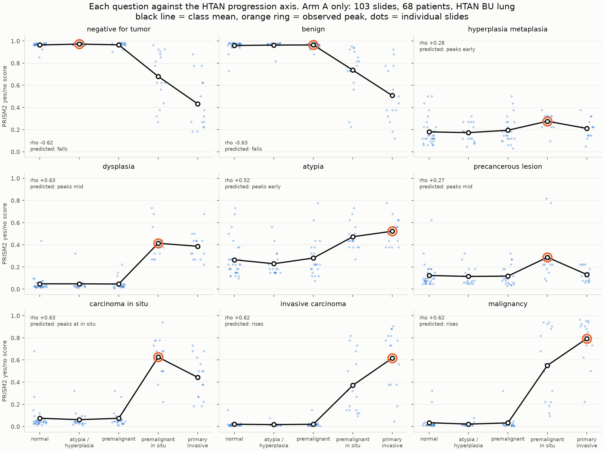
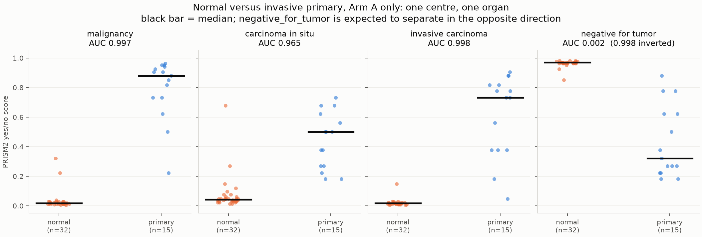
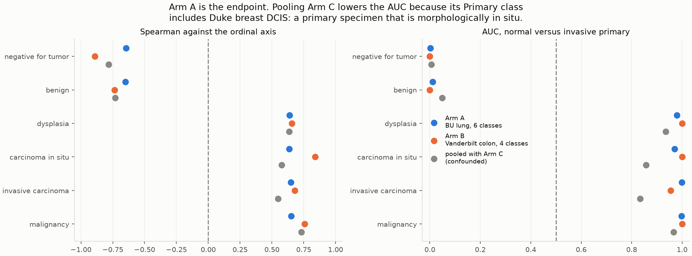
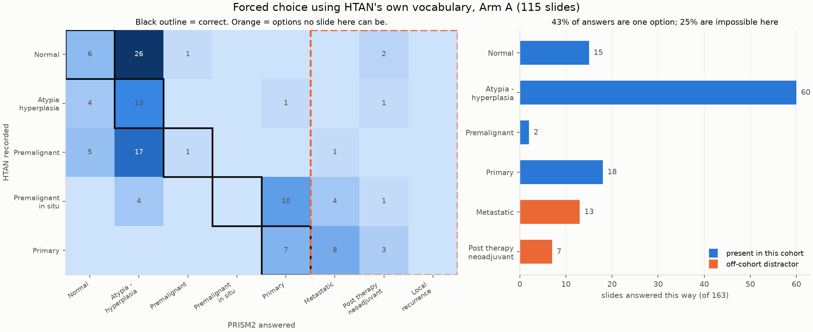
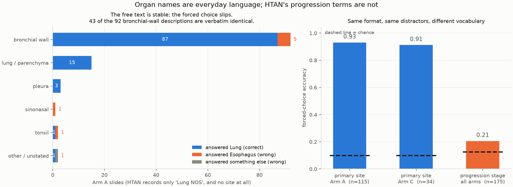

# HTAN progression cohort: results

Run `nf-prism2-progression-188-resume` (`20zEYRdNeMfjuM`), 20 Aug 2026, `nf-prism2` at `160fb4b`,
spot `p4d.24xlarge`. **163 slides scored, 128 patients.** Scoring follows
`assets/questions_htan_progression.md`, fixed before the run.

**Read Arm A for the progression endpoint.** Arm A is HTAN BU lung, 103 slides and 68 patients
with all six classes, one centre and one organ, which is what removes the scanner and stain
confound. Arm B is a separate replication. Arm C is primary-only across organs and is never
pooled into the progression statistics, for a reason given in section 2b.

## Headline

Asked in pathology report language, PRISM2 tracks the HTAN progression axis closely. Asked the
same question in HTAN's curation vocabulary, it does not. That contrast is the main result.

## 1. The yes/no ladder works

**Arm A**, Spearman against the ordinal axis, 95% CI bootstrapped over **patients** (32 patients
contribute more than one specimen, so slide-level resampling would overstate precision):

| Question | rho | 95% CI | Observed peak | Predicted |
|---|---|---|---|---|
| `benign` | **-0.63** | -0.75 to -0.49 | normal adjacent | falls, yes |
| `negative_for_tumor` | **-0.62** | -0.73 to -0.46 | atypia | falls, yes |
| `carcinoma_in_situ` | +0.63 | 0.51 to 0.73 | **in situ** | peaks at in situ, **yes** |
| `dysplasia` | +0.63 | 0.50 to 0.74 | in situ | peaks mid, yes |
| `invasive_carcinoma` | +0.62 | 0.46 to 0.73 | primary | rises, yes |
| `malignancy` | +0.62 | 0.47 to 0.74 | primary | rises, yes |
| `atypia` | +0.52 | 0.39 to 0.65 | primary | peaks early, no |
| `hyperplasia_metaplasia` | +0.28 | 0.14 to 0.42 | in situ | peaks early, no |
| `precancerous_lesion` | +0.27 | 0.13 to 0.39 | in situ | peaks mid, weakly |

Six of nine behaved as pre-registered. The one that matters most is `carcinoma_in_situ`: it rises
through the precancer classes, **peaks at carcinoma in situ, then falls again for invasive
disease**. A model with a single "abnormality" axis cannot do that. It implies a lesion-type
distinction, which is what makes these scores worth using as features rather than as a detector.

`hyperplasia_metaplasia` and `atypia` did not peak where predicted, and both are weak. The most
likely reason is that both terms describe changes that persist alongside carcinoma rather than
being replaced by it, so a monotone reading is not obviously wrong.

## 2. Normal versus invasive primary

The endpoint the 10-slide pilot could not compute, having had 6 positives and 1 negative and
returned AUC 0.50. **Arm A**, n+ = 15 invasive primaries against n- = 32 normal and normal
adjacent, all HTAN BU lung:

| Question | AUC | Tied pairs |
|---|---|---|
| `invasive_carcinoma` | **0.998** | 0.0% |
| `malignancy` | **0.997** | 0.2% |
| `carcinoma_in_situ` | 0.965 | 0.8% |
| `negative_for_tumor` | 0.002, that is **0.998** in its own direction | 0.0% |

Separation within a single centre and organ is essentially complete.

### 2b. Why pooling makes this look worse, and what that says about the label

Pooling Arm C drops `invasive_carcinoma` from 0.998 to 0.829 and `carcinoma_in_situ` from 0.965
to 0.853, while inflating the Spearman values (`negative_for_tumor` goes from -0.62 to -0.78)
because 34 extra strongly separated primaries pile up at the top of the axis. Both movements are
artefacts of pooling, in opposite directions.

The AUC drop has a specific cause worth recording. **`TumorTissueType = Primary` means "this is
the primary tumour specimen", not "this tissue is invasive."** Arm C's primaries include Duke
breast DCIS cases, which are primary specimens that are morphologically in situ. When the model
scores those low on `invasive_carcinoma` it is correct and the label is what misleads. Anyone
using `TumorTissueType` as an invasiveness label will silently inherit this.

Arm B replicates the axis directionally in a different organ and centre, rho -0.89 for
`negative_for_tumor` to +0.84 for `carcinoma_in_situ`. Its AUCs are 0.955 to 1.000 but rest on
**2 normals**, so they are not reported as evidence.

bf16 quantisation is still present, 41 distinct values across 927 Arm A scores, but at this cohort
size it costs under 2.5% tied pairs and does not threaten the conclusions. That is a change from
the pilot, where 72 scores collapsed onto 32 values. **True fp32 turns out to be unavailable**:
PRISM2's released code casts the Perceiver to bf16 whatever `torch_dtype` says, and flash
attention, which the Perceiver requires, supports only fp16 and bf16. So the grid is a property
of the released model, not a setting we failed to flip.

## 3. The forced-choice stage question fails, and the distractors proved it

Exact accuracy **0.209** against 0.125 chance across all arms, within one ordinal step 0.558. The answer
distribution is the real finding:

* **43% of slides received "Atypia - hyperplasia"** regardless of what they were. The confusion
  matrix shows it as a vertical stripe: 25 of 33 normals, 17 of 30 premalignant, 8 of 60 primaries.
* **24.5% received an off-cohort distractor**, 21 "Metastatic" and 19 "Post therapy neoadjuvant".
  The second is a statement about whether the patient had neoadjuvant treatment, which no
  morphology can support.
* Only 1 slide of 163 was called "Premalignant - in situ", the class the ladder detects best.

**The explanation is a vocabulary mismatch, not a capability gap.** `Premalignant`,
`Atypia - hyperplasia` and `Post therapy neoadjuvant` are curation categories. PRISM2 learned from
clinical reports, which say "atypical adenomatous hyperplasia" and "adenocarcinoma in situ". The
same underlying question scored rho -0.78 to +0.73 in report language and near chance in data
model language.

Using the data model's valid values verbatim was the principled choice and it is exactly what
exposed the mismatch. Including off-cohort distractors was what made the failure legible: without
them this reads as mediocre 21% accuracy rather than "a quarter of answers name a category that
cannot occur here".

## 3b. What Arm C was for, and the site question

Arm C is primary-only across organs and contributes nothing to the progression axis. Its purpose
is the organ and type questions, which cannot be asked of Arm A because Arm A is entirely lung,
and several-centres-per-organ structure for the tile-level analysis.

**The site question works: 0.91 correct in both arms** against 0.10 chance, 74 of 81 in Arm A and
31 of 34 in Arm C. Set beside the 0.209 on progression stage, this is the strongest form of the
vocabulary argument. Same model, same forced-choice format, same data model sourcing, same
off-cohort distractors. Organ names are everyday language that appears in every report the model
trained on; `Premalignant` and `Post therapy neoadjuvant` are curation categories that do not.

**The seven wrong answers are not a perceptual failure.** All seven chose "Esophagus NOS", an
off-cohort distractor. Their free-text descriptions are *verbatim identical* to those of 78 slides
that answered Lung correctly: "This specimen was taken from the bronchial wall." So the model sees
the same thing and then picks differently. The inconsistency is in the choosing, not the seeing,
which is the same pattern as the pilot slide that answered "squamous cell carcinoma" on forced
choice and "the specimen is negative for tumor" in its report.

**A useful aside for the resource.** 83 of 103 Arm A slides were described as bronchial wall,
which is anatomically right for an airway precancer atlas and **more specific than HTAN's own
`TissueorOrganofOrigin`, which records only "Lung NOS"**. The field that would have captured it,
`SiteofResectionorBiopsy`, is empty for all 103. So the generated text is finer-grained than the
metadata here, which is an argument for using it to enrich rather than only to validate.

**Arm C only partly delivered its second purpose.** As realised it is Duke breast (22), WUSTL
pancreas (11) and one HMS fallopian tube: one centre per organ, not several. Ten of the 24 lost
slides were Arm C, and the 1.5 GB size cap squeezed out the HMS colorectal and skin OME-TIFFs.
The tile-locking analysis therefore still cannot fully separate slide identity from centre, and a
small top-up run of HMS colorectal and skin is the cheap fix.

## 4. What this means for the resource

1. **Ask in report language.** For any HTAN field to be probed, phrase the question the way a
   pathologist would write it and map the answer back to the controlled vocabulary afterwards.
   Do not put curation terms in the prompt.
2. **Use the scores as ranks.** The separation is in the ordering, and the ladder profile carries
   more information than any single threshold.
3. **Prefer open-ended answers where the vocabulary is unusual.** The free text was stable where
   the forced choice was not, and in one case it was more specific than the HTAN field it would
   have been scored against.
4. **Off-cohort distractors should be standard** in any forced-choice evaluation against a
   controlled vocabulary. They cost nothing and they distinguish "somewhat accurate" from
   "not engaging with the options".
5. **The progression axis is a usable endpoint for HTAN**, and it is the kind of question HTAN is
   uniquely positioned to ask, since the precancer atlases supply the classes no other public
   collection has at this scale.

## 5. Slides that could not be processed, and why

175 of 188 slides produced results after one retry run. The 13 that did not have three distinct
causes, none of which is a pipeline defect:

* **Ten HMS OME-TIFFs are not 20x images.** Their OME-XML records `PhysicalSizeX = 2.7235 um`,
  which at 8064 x 9417 pixels is a 22 x 26 mm field at roughly **3.7x**, a whole-slide overview.
  Tiling at 224 px and 20x would need 5.4x upsampling. HTAN records `NominalMagnification: 20`
  for all of them, and all ten share identical dimensions despite file sizes from 0.46 to
  1.14 GB, so they are one deposit whose magnification field is wrong. No reader or mpp setting
  could have recovered them. `scripts/build_progression_cohort.py` now rejects anything coarser
  than 1.0 um/px, since 20x is about 0.5 um/px.
* **One BU slide returned an empty tissue mask.** hest segmentation found no foreground, so no
  coordinates and no features. Lowering `--seg_conf_thresh` or switching to otsu would likely
  recover it.
* **One Duke tif and one Vanderbilt OME-TIFF** failed on read and were not chased further.

The loss falls almost entirely on Arm C, which is the arm least able to spare it, since Arm C
exists to supply several centres per organ for the tile-level analysis. Arm A is unaffected and
now has 17 to 19 patients in every class.

Getting the true pixel size out of these files costs nothing: the OME-XML header is readable by
byte range in under a megabyte, which is how the 2.72 um figure above was obtained.

## Caveats

* 26 of 188 slides failed to process, 13 svs and 11 OME-TIFF, mostly segmentation OOM at 24 GB on
  very large images. Arm A still retained 15 to 18 patients in every class.
* Arm A is a single centre and a single organ by design, which removes the scanner confound but
  makes the headline result lung-specific. Arm B replicates the direction in colon, with too few
  normals to quantify.
* `TumorTissueType` describes the biospecimen block, not the exact section on the glass.
* No pathologist has read these slides. Disagreements are not adjudicated.
