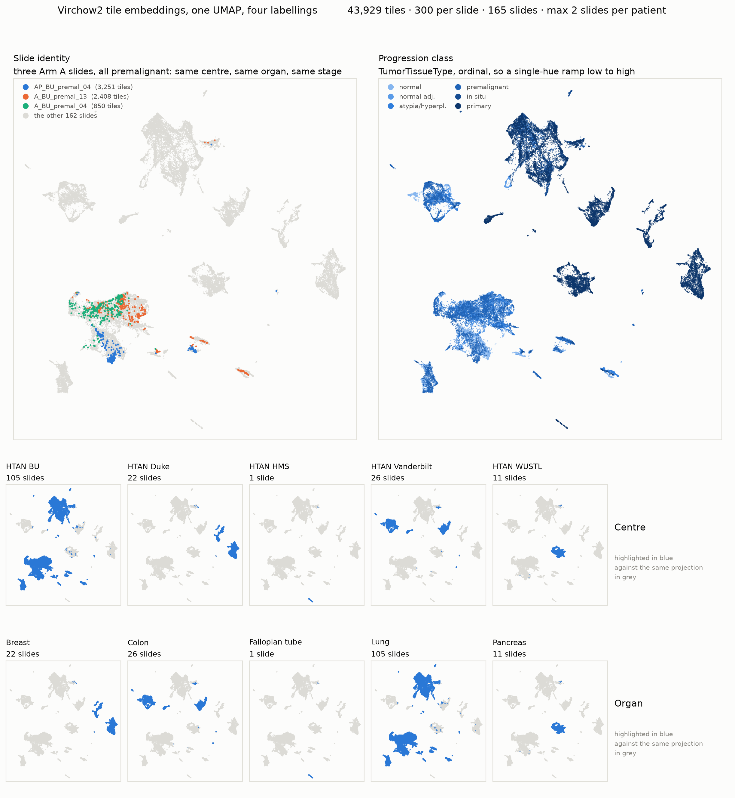
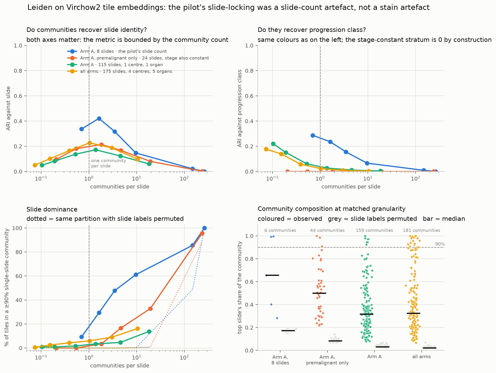
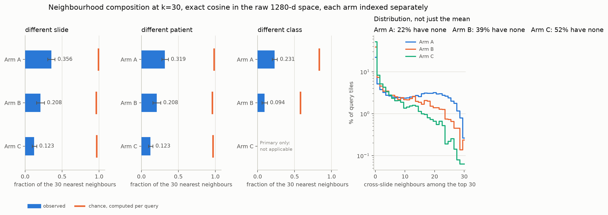
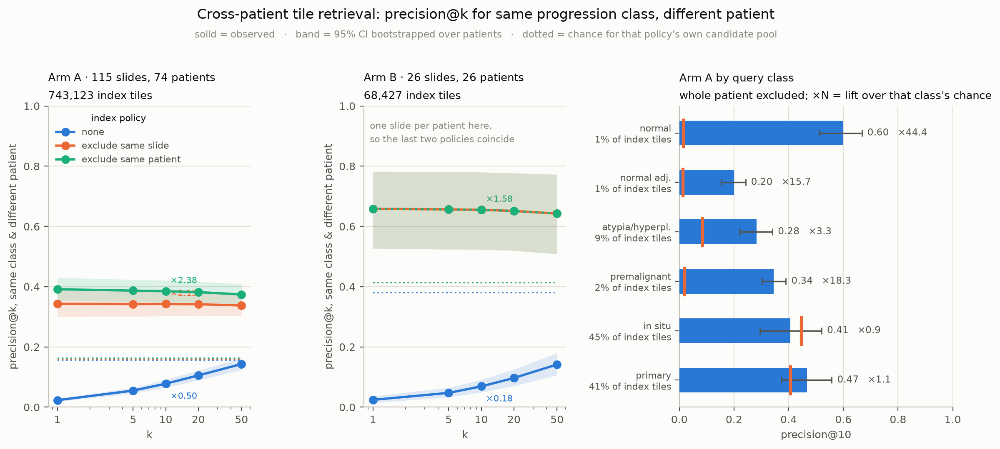
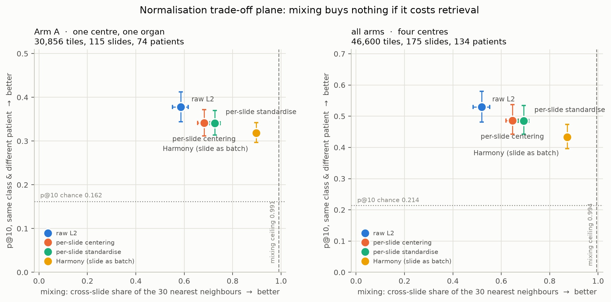
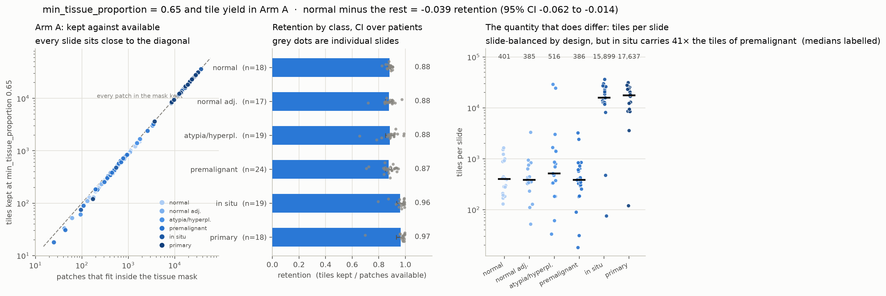
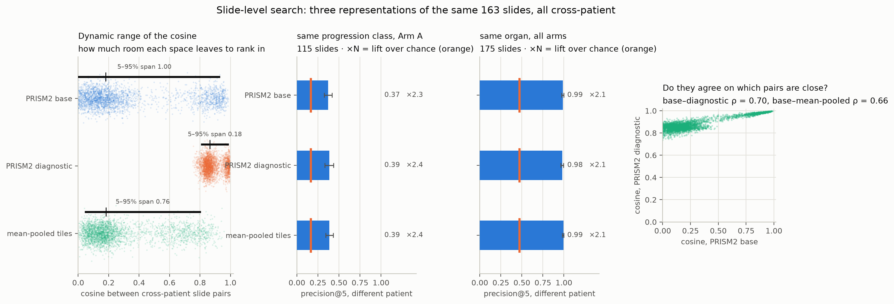
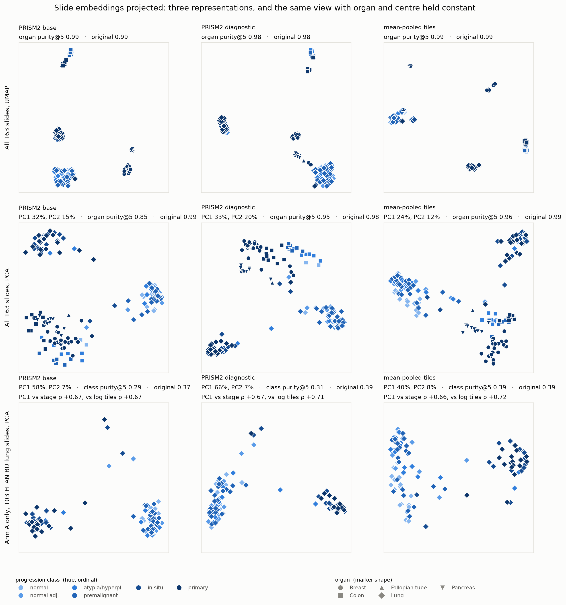

# The HTAN tile embedding space, and whether tile-level vector search is viable

Tile features from two runs: `nf-prism2-progression-188-resume` (`20zEYRdNeMfjuM`) plus the 12
slides recovered by `nf-prism2-progression-retry25c`, both 20 Aug 2026. **175 slides, 134 patients,
859,342 Virchow2 class tokens at 1280-d**, median 756 tiles per slide, maximum 36,399. Companion to
`benchmark_results/progression_20260820/ANALYSIS.md`, which scores the same slides at slide level.

**All 12 recovered slides are Arm A**, and six of them are large resections, so Arm A's tile index
grew 35%, from 551,318 to 743,123. That matters here more than it does at slide level, because
several of the findings below are functions of index size. Section 3 says what happened when the
index grew: nothing much, which was not the prediction.

**Read Arm A for anything about slide identity.** Arm A is 115 slides and 74 patients of HTAN BU
lung: one centre, one scanner and stain protocol, one organ, six progression classes. It is the
stratum that can separate "tiles cluster by slide" from "tiles cluster by laboratory", which the
10-slide pilot could not. Arm B (26 Vanderbilt colon) and Arm C (34 primary-only across Duke,
WUSTL and HMS) are reported separately and never pooled into a single number.

176 feature files exist but one, `C_Duke_primary_21`, contains zero tiles: its segmentation found
tissue and no patch cleared `min_tissue_proportion=0.65`. The retry re-ran it and it produced zero
tiles again. It is excluded everywhere, which is why 175 and not 176.

## Headline

**The pilot's central negative result does not replicate, and the reason is instructive.** Tile
embeddings are not slide-locked. 36% of an Arm A tile's 30 nearest neighbours come from a
different slide, against the pilot's 0.5%, and Leiden recovers slide identity at ARI 0.17 rather
than 0.9. The pilot's number was a **slide-count artefact**: with 8 slides in the index there were
very few candidate tiles anywhere else that genuinely resembled a given query, and both of the
metrics it used are additionally bounded by how many communities the partition has. Re-run at the
pilot's slide count inside Arm A, the pilot's numbers reappear. The confound it worried about,
between-centre stain, turns out not to be the issue at all.

**So tile-level search works, but only with patient-level exclusion, and it buys nothing over
slide-level search.** An unfiltered tile index spends 76% of its top 10 on the query's own slide
and scores *below chance*. Exclude the patient and precision@10 for same-class-different-patient is
0.385 against 0.162 chance, a lift of 2.38. PRISM2's slide embedding reaches a comparable lift,
2.29, on the same task from 5,000 times fewer vectors. And DuckDB's HNSW index, written the
obvious way, answers the filtered query with 2.8 rows and recall 0.18 without raising an error.

## 1. What the space is organised by



43,929 tiles, 300 per slide, at most two slides per patient, one UMAP with four labellings.

Centre and organ are the coarse structure, and in this cohort they are almost the same variable:
each atlas contributes one organ, so the two panels are near-identical by construction. Inside the
94-slide HTAN BU island the split is by **progression class**, with the light end of the ordinal
ramp (normal, atypia, premalignant) occupying one lobe and the dark end (in situ, primary) another.
That is the first encouraging sign, and it is only visible because Arm A supplies enough slides of
each class within one centre to form a lobe at all.

The slide panel highlights three Arm A premalignant slides, so centre, organ and stage are all
constant. They overlap substantially and each also holds territory the others do not. That is the
picture the rest of the analysis quantifies: partial, not total, slide separation.

**A metadata finding in passing.** `TissueorOrganofOrigin` is blank for 52 of the 175 slides. HTAN
BU records it for 90 of 115 and HTAN Vanderbilt for none. Both atlases are single-organ by
construction, so organ is resolved from the atlas where the field is empty and the affected rows
are flagged (`organ_imputed`) rather than dropped. Anyone joining on that field alone loses a
third of this cohort.

## 2. The deconfound: a slide-count artefact, not a stain artefact



Both of the pilot's clustering statistics are bounded by the number of communities. ARI against
slide peaks when communities and slides are equally numerous; the percentage of tiles in a
community where one slide supplies at least 90% cannot be large when there are 22 communities and
115 slides, whatever the embeddings look like. So resolution is swept until communities outnumber
slides, everything is plotted against **communities per slide** rather than the resolution
parameter, and the permutation null (same partition, slide labels shuffled) is drawn alongside.

At matched granularity, roughly one community per slide, holding tiles per slide fixed at 300:

| stratum | slides | communities | ARI vs slide | ARI vs class | % tiles slide-dominated | median top-slide share | same, permuted |
|---|---|---|---|---|---|---|---|
| Arm A, 8 slides (the pilot's count) | 8 | 6 | **0.337** | 0.287 | **9.2%** | 0.599 | 0.173 |
| Arm A, premalignant only | 24 | 44 | 0.214 | 0 by design | 3.5% | 0.500 | 0.083 |
| Arm A | 115 | 159 | **0.172** | 0.027 | **3.4%** | 0.316 | 0.031 |
| all arms | 175 | 181 | 0.227 | 0.023 | 6.0% | 0.324 | 0.022 |

These are the rows the figure's fourth panel draws, one per stratum, each at the resolution whose
community count comes closest to its slide count. The 8-slide stratum peaks finer than that, at 13
communities, where it reaches ARI 0.421 and 47.8% slide-dominated.

The 8-slide row moved most between the 103-slide and 115-slide versions of this analysis, from ARI
0.465 to 0.337, and that is expected rather than worrying: it is the mean of five random draws of
8 slides from a pool that changed, so it has the sampling variance of an 8-slide experiment. That
variance is the finding. The 115-slide row moved from 0.176 to 0.172.

The 8-slide row is the pilot's regime reproduced inside Arm A, averaged over five independent
draws, and it recovers the pilot's conclusion: ARI up to 0.42 against slide at 13 communities, and
a median community that is 60% one slide against a permuted 17%. Add the other 107 Arm A slides and
the same measurement gives ARI 0.172 and a median share of 32%. **Holding centre, organ and
protocol constant did not remove the effect; adding slides did.** A literal reproduction of the
pilot's configuration, 8 slides at 1,500 tiles each over resolutions 0.1 to 2.0, gives ARI 0.32 to
0.49 and 20 to 54% slide-dominated, which brackets the pilot's report.

Two further readings. Slide dominance in Arm A (3.4%) is *lower* than across all arms (6.0%),
which is the opposite of what a stain-batch explanation predicts. And ARI against progression class
is highest at coarse granularity in exactly the two large strata, 0.220 for Arm A and 0.177 for all
arms, where it exceeds ARI against slide. At the scale that matters, the
first thing Leiden finds inside one centre and one organ is the progression axis, not the slide.

Observed dominance stays clear of the permutation null everywhere except the far right of the
sweep, where communities become smaller than slides and both saturate at 100%. That saturation is
why the null is on the figure.

## 3. What is actually in a tile's neighbourhood



Exact cosine in the full 1280-d space, k=30, each arm indexed on its own with every one of its
tiles, queried by 200 slide-balanced tiles per slide. Chance is computed per query from that
query's own candidate pool, because a tile from a 36,399-tile slide has proportionally far fewer
off-slide candidates than a tile from a 200-tile slide.

| arm | slides / centres | different slide | different patient | different class | queries with no cross-slide neighbour |
|---|---|---|---|---|---|
| A | 115 / 1 | **0.356** (0.305–0.404) | 0.319 (0.276–0.364) | 0.231 | 22.2% |
| B | 26 / 1 | 0.208 (0.155–0.260) | 0.208 | 0.094 | 39.1% |
| C | 34 / 3 | 0.123 (0.094–0.156) | 0.123 | not applicable | 52.1% |

The pilot's figure was 0.005 with a ceiling of 0.875. Arm A's is **0.356 with a per-query chance of
0.991**, so tiles are still strongly self-attracted, roughly a third of the way to indifference
rather than a two-hundredth. The median Arm A tile has 10 of its 30 neighbours on other slides.

The distribution matters as much as the mean and is bimodal: 22.2% of Arm A tiles have *no*
cross-slide neighbour at all in their top 30, while a second mode sits near 15 to 20 of 30. Some
tiles have genuine counterparts elsewhere in the cohort and some do not, and a mean of 0.356
describes neither group.

**The retry supplied a test of the index-size explanation, and it failed.** The earlier version of
this section attributed Arm A's lead over Arms B and C to index size, 551,318 tiles against 68,427
and 47,792, and predicted that the number was therefore a floor for full HTAN. Arm A's index then
grew 35% to 743,123 tiles, and cross-slide neighbours went from 0.361 to **0.356**: flat, and if
anything slightly down. The prediction was wrong, and the reason is visible in what the retry
added. Six of the 12 recovered slides carry 18,000 to 29,000 tiles each, so they brought their own
within-slide neighbours with them; more slides pushes mixing up and larger slides push it down, and
here the two cancelled. So **index size alone does not buy cross-slide mixing**: the composition of
what is added matters as much as the count, and Arm A's lead over Arm C is better explained by
Arm C spanning three centres and three organs, where most of a tile's candidate pool is a different
tissue from a different laboratory. Only the Arm A figure is a clean measurement of slide
self-attraction, and it is stable at about 0.36.

## 4. Retrieval scored the way a search tool would have to score it



Relevance is **same progression class AND a different patient**, because a hit from the query's own
slide is worthless to a pathologist and a hit from the same patient's other block is nearly so.
Three index policies, chance recomputed per query and per policy. Arm C is excluded: it is
Primary-only, so same-class is satisfied by every tile in the arm.

| Arm A, 115 slides, 743,123 tiles | p@1 | p@10 | p@50 | chance | lift @10 | own-slide share of top 10 |
|---|---|---|---|---|---|---|
| no exclusion | 0.020 | **0.078** | 0.146 | 0.156 | **0.50** | **0.763** |
| exclude same slide | 0.346 | 0.343 | 0.340 | 0.160 | 2.15 | 0 |
| exclude same patient | 0.392 | **0.385** | 0.378 | 0.162 | **2.38** | 0 |

**A naive tile index is worse than random.** Three quarters of the result page is the query's own
slide, and after slide exclusion a further 8% of it is the same patient's other specimen. The
example output in `example_queries.md` shows this concretely: querying an in situ tile from
`A_BU_insitu_06` and excluding only its slide returns ten tiles, all of them from
`A_BU_primary_08`, which is the same patient. Patient-level exclusion is not a refinement, it is
the difference between a working tool and a broken one. Arm B behaves the same way, 0.069 rising to
0.655 against a chance of 0.414, and there slide and patient exclusion coincide because every Arm B
patient contributed one slide.

Precision is nearly flat in k, which is what a usable index looks like: the 50th hit is about as
good as the 1st.

**Per-class precision is governed by tile prevalence, not by how distinctive the class is.** With
the whole patient excluded, normal tiles reach p@10 0.600 from 1.4% of the index, a lift of 44,
while carcinoma in situ reaches 0.406 from 45% of the index, a lift of 0.91, below chance. The
rare classes are found; the abundant ones are simply everywhere. Section 6 shows this imbalance is
a property of the specimens, not of our preprocessing.

## 5. Normalisation still does not help, and now the reason is unambiguous



Two metrics that pull against each other, on a slide-balanced sample so mixing is not dominated by
the largest slides: mixing (cross-slide share of the 30 nearest neighbours, higher better) against
p@10 for same-class-different-patient with the whole patient excluded (higher better).

| Arm A, 30,856 tiles, 115 slides | mixing | p@10 |
|---|---|---|
| raw L2 | 0.586 | **0.378** (0.345–0.412) |
| per-slide centering | 0.682 | 0.341 |
| per-slide standardisation | 0.727 | 0.341 |
| Harmony, slide as batch | **0.898** | 0.319 |

Monotone in both strata, and the all-arms panel is the same shape (raw 0.519 / 0.529 through to
Harmony 0.872 / 0.433). Every value moved by less than 0.02 when the cohort grew by 12
slides. Every treatment raises mixing and lowers precision, in the correct rank
order. **Raw L2 is the best retrieval space available, and the mixing metric on its own is
actively misleading**: Harmony scores nearest to the 0.990 ceiling and retrieves worst. The pilot's
one apparent exception, Harmony improving cross-slide p@10, does not survive a cohort with more
than three slides of one organ.

Harmony is also disqualified structurally, whatever it scores. Its correction is a per-cell offset
learned jointly over the whole dataset and it has no out-of-sample transform, so adding one slide
to a growing index means recomputing every embedding already in it.

The mixing figures here (0.586) and in section 3 (0.356) are not comparable and should not be
quoted together: this section indexes 300 tiles per slide, section 3 indexes every tile. Equalising
slides raises mixing because it deletes the large slides' self-attracting mass.

## 6. `min_tissue_proportion = 0.65` did not over-filter normal lung



The pipeline raised TRIDENT's default 0.0 to the Virchow2 paper's 0.65, keeping a 224 px patch only
if at least 65% of it lies inside the tissue mask. Alveolar lung is lacy, so the worry was that
normal parenchyma lost tiles that lesional tissue did not, which would confound every per-class
comparison. Retention is measured against the segmentation the pipeline already publishes:

    retention = tiles kept / (segmented tissue area / level-0 patch area)

Both areas are level-0 pixels from the same slide, so magnification cancels. Interior rings are
subtracted, so holes are not counted as tissue.

| Arm A class | slides | retention | median tissue | median tiles |
|---|---|---|---|---|
| normal | 18 | **0.880** | 5.7 mm² | 402 |
| normal adjacent | 17 | 0.877 | 5.6 mm² | 385 |
| atypia / hyperplasia | 19 | 0.884 | 7.2 mm² | 516 |
| premalignant | 24 | 0.874 | 5.4 mm² | 386 |
| carcinoma in situ | 19 | 0.961 | 208.5 mm² | 15,899 |
| primary invasive | 18 | 0.966 | 227.3 mm² | 17,638 |

Normal minus the rest is −0.039 (95% CI −0.062 to −0.014, bootstrapped over patients): detectable,
and **explained by specimen size rather than by class**. Among the four small-biopsy classes,
normal retains second best of the four at 0.880, behind atypia at 0.884 and ahead of premalignant
at 0.874.
The two high-retention classes are 30-fold larger resections, where the mask's perimeter, and so
the fraction of patches straddling its edge, is proportionally much smaller. So the answer to the
question as posed is no: 0.65 costs about 13% of the available patches on a 5 mm² biopsy whatever
is on it, and nothing specific to normal lung.

**The real finding here is a different one. Arm A is slide-balanced and 41-fold tile-imbalanced.**
17 to 24 slides per class by design, but a median 15,899 tiles for carcinoma in situ against 386
for premalignant. In situ and primary are 19 and 18 slides of 115 and supply 88% of Arm A's
743,123 tiles. This is the quantity that drives every per-class retrieval number in section 4, and
it is invisible in a slide-level analysis. Any tile-level statistic over this cohort has to be
computed slide-balanced or reported with its per-query chance, and both are done throughout here.

## 7. Slide-level search, and whether the Perceiver earns its keep



Three representations of the same 175 slides: PRISM2 `base` (2560-d), PRISM2 `diagnostic`
(3072-d), and the arithmetic mean of each slide's Virchow2 tile vectors (1280-d). All cosines are
cross-patient.

| | cosine range | 5–95% span | p@5 same class, Arm A | lift | p@5 same organ, all arms | lift |
|---|---|---|---|---|---|---|
| PRISM2 base | −0.248 to 0.991 | 1.00 | 0.372 | 2.29 | 0.987 | 2.10 |
| PRISM2 diagnostic | 0.737 to 0.998 | **0.18** | **0.386** | **2.37** | 0.982 | 2.09 |
| mean-pooled tiles | −0.062 to 0.958 | 0.76 | **0.386** | **2.37** | **0.994** | 2.12 |

Two pilot conclusions need correcting, both in the same direction.

**The diagnostic embedding's narrow band is a calibration problem, not a ranking problem.** The
pilot's observation replicates: it occupies 0.74 to 1.00 while base spans the full range. The band
here is wider than the pilot's 0.82 to 0.95, as it should be on 175 slides rather than 10, but the
shape of the finding is the same.
But it ranks just as well, and on the larger cohort marginally better: 0.386 against 0.372 for
same class, 0.982 against 0.987 for organ.
So "the diagnostic embedding is not a usable retrieval space" is too strong. It cannot carry an
absolute similarity threshold, and a tool that shows users a similarity score should not use it,
but for ordering results it is interchangeable with base.

**Mean pooling is not obviously worse than the Perceiver for search.** It ties the best score on
both tasks and the confidence intervals overlap throughout, so the honest reading is a tie rather
than a win, and its pair orderings agree with base at Spearman 0.66,
not the pilot's 0.05. Another n=8 artefact. This is a narrow claim: these two tasks are
label-recovery tasks, and the pilot's finding that mean pooling's top pairs are biologically
meaningless was a qualitative read that these numbers do not address. But if the question is "which
slide vector should the search index hold", the 1280-d mean of tiles is a serious answer, and it
comes free with the tile pass.

Same-organ retrieval is essentially solved at slide level, p@5 0.99 against 0.47 chance. Same
progression class within one centre and organ is not, p@5 0.37 to 0.39 against 0.16, which is the
same place tile-level search lands. Section 7b shows that this number also has a size confound
behind it, so treat it as an upper bound on what morphology alone is contributing.

### 7b. The slide space projected, and what its dominant axis is actually tracking



Hue is the ordinal progression class on the blue ramp; marker shape is organ. Neither is a
five-hue scatter, for the reason given in section 1.

**UMAP at n=175 tells you only what you already knew.** It collapses each organ into a tight
island and discards everything inside them. That is not a failure of the projection so much as
what UMAP does when the groups are cleanly separated and the sample is small: it preserves the
neighbourhood faithfully (organ purity@5 0.990 in the 2-D layout against 0.989 in the full 2560-d
space for `base`) and then spends all its resolution on the between-organ gaps. As a picture of the
space it is close to useless, which is worth stating because it is the picture most people will
make first.

**PCA is the more informative view, and it is also the control.** PC1 and PC2 carry 45% of the
variance for `base`, 51% for `diagnostic`, 35% for mean-pooled. It loses more of the organ
neighbourhood than UMAP does (0.85 for `base`, 0.95 for `diagnostic`, 0.96 for mean-pooled)
precisely because it is not trying to protect it, and in exchange the within-organ gradient becomes
visible: the lung diamonds split into a light-blue group and a dark-blue group in every
representation.

**Restricting to Arm A, where centre and organ are constant, gives the striking number and the
catch.** PC1 alone carries **58% of the variance for `base` and 66% for `diagnostic`** across 115
HTAN BU lung slides, and it is ordered: Spearman +0.67 against the ordinal progression axis. It
would be easy to call that the progression axis.

It cannot be called that from this cohort, and the retry made that clearer rather than less clear.
The same PC1 correlates with **log tile count at +0.67 to +0.72**, which for `diagnostic` and
mean-pooled now *exceeds* its correlation with stage, and stage and log tile count are themselves
correlated at +0.57 because of the 41-fold imbalance in section 6. Specimen size and
progression stage are confounded in Arm A by construction: the precancer classes are small
biopsies and the in situ and primary classes are large resections. So the dominant axis of PRISM2's
slide space, within one centre and one organ, is consistent with a progression axis and equally
consistent with "how much tissue was on the glass", and this design cannot separate them.

| Arm A, 115 slides | PC1 variance | PC1 vs stage | PC1 vs log tiles | class purity@5, original |
|---|---|---|---|---|
| PRISM2 base | 58% | +0.67 | +0.67 | 0.37 |
| PRISM2 diagnostic | 66% | +0.67 | **+0.71** | 0.39 |
| mean-pooled tiles | 40% | +0.66 | **+0.72** | 0.39 |

Two things follow. First, class purity@5 stays at 0.37 to 0.39 in the original space, so whatever
PC1 is, it separates something coarser than the six classes; the fine distinctions the yes/no
ladder picks up in the slide-level analysis are not the leading direction of the embedding.
Second, **the size confound is a cohort design fault worth fixing before this axis is used as a
feature**, and the fix is cheap: sample precancer and invasive specimens matched on segmented
tissue area, or regress log tissue area out before interpreting a component. Neither needs a new
sequencing run, only a different samplesheet.

## 8. The DuckDB prototype, and the way it breaks

Full numbers in `duckdb_benchmark.md`, schema in `duckdb/schema.sql`, the queries in
`duckdb/queries.sql` with their real output in `example_queries.md`. 859,342 tiles, three vector
columns (raw 1280-d, L2-normalised 1280-d, 128-d PCA), 175 slides with `base`, `diagnostic` and
mean-pooled vectors, DuckDB 1.5.5 with `vss`, on a laptop.

Build: 215 s to load, 16.4 GB of table, then 129 s for the 1280-d HNSW index (2.67 GB) and 24 s for
the 128-d one (0.57 GB). The 29% more rows cost 90% more index build time, so **HNSW build is
clearly superlinear here**, and the linear extrapolation below understates it. `hnsw_enable_experimental_persistence` has to be set both to create and to
*read* a persisted index, and DuckDB warns that an unclean shutdown mid-write can corrupt it.

Unfiltered accuracy is fine:

| configuration | median | recall@10 vs exact 1280 | recall@50 |
|---|---|---|---|
| exact 1280 (scan of the unindexed column) | 640 ms | 1.000 | 1.000 |
| HNSW 1280 | 28 ms | 0.947 | 0.944 |
| exact 128 (PCA) | 43 ms | 0.770 | 0.794 |
| HNSW 128 (PCA) | **3 ms** | 0.757 | 0.792 |

The PCA row splits cleanly: against its *own* exact answer the 128-d index scores 0.935, so the
0.757 against the 1280-d answer is mostly the projection's cost, not the index's. PCA-128 keeps 79%
of the variance and about 77% of the top-10, a fair trade at a tenth of the storage, a 15-fold
faster exact scan and a 10-fold faster indexed one, and the right default for full HTAN.

**Then the filtered queries, which are the only useful ones.** Written the obvious way, DuckDB
pushes the `LIMIT` into the HNSW index scan and applies the `WHERE` clause to the ten rows that come
back. Since 76% of those rows are the query's own slide (section 4), the filter deletes most of the
result:

| predicate | strategy | median | rows returned | queries under 10 rows | recall@10 |
|---|---|---|---|---|---|
| exclude own slide | naive `WHERE ... ORDER BY ... LIMIT 10` | 11 ms | **2.6** | **93%** | **0.227** |
| exclude own slide | over-fetch 100, then filter | 43 ms | 7.4 | 30% | 0.703 |
| exclude own slide | over-fetch 1,000, then filter | 597 ms | 9.4 | 7% | **0.937** |
| exclude own slide | over-fetch 10,000, then filter | 656 ms | 9.7 | 3% | 0.970 |
| exclude own slide | exact scan | 713 ms | 10.0 | 0% | 1.000 |
| different centre only | naive | 15 ms | **0.3** | 97% | **0.000** |
| different centre only | over-fetch 100,000, then filter | 669 ms | 8.1 | 19% | 0.810 |
| different centre only | exact scan | **547 ms** | 10.0 | 0% | **1.000** |

Excluding the query's own patient behaves the same way (0.207 naive, 0.937 at F=1,000, 66 ms).
**The centre-crossing row got worse, not better, with a bigger index**: the naive form now returns
0.3 rows and recall 0.000, and even F=100,000 only reaches 0.810, against 0.917 on the smaller
index. Deeper indexes are harder to walk to a rare predicate, which is the opposite of the
direction people assume scale helps. This is the failure mode the analysis was built to catch: **fast, uses the index, no
error, and wrong.** A resource that shipped the naive form would return near-arbitrary
cross-slide hits, and every conclusion drawn through it would be unfalsifiable.

Three operational rules come out of it.

1. **Over-fetch, and state the factor.** F = 1,000 gives recall 0.94 for patient exclusion at
   66 ms. F = 100 is 7 ms and 0.64, which is a reasonable interactive default if the page is
   re-ranked exactly afterwards. The factor has to be re-tuned as the index grows: at 667k tiles
   F = 1,000 cost 27 ms, at 859k it costs 66 ms for slide exclusion and 597 ms for the same
   predicate on a colder page cache.
2. **Centre-crossing queries must be exact scans.** A tile's neighbours are overwhelmingly from its
   own centre, so the index cannot be walked to a rare predicate at all: F = 100,000 reaches only
   0.810 and costs 669 ms, while the exact scan is correct and *faster* at 547 ms.
3. **The query vector has to be a bound parameter.** The natural SQL reads it out of the table in a
   CTE and joins it in, which makes it non-constant and defeats the index: 1,658 ms against 3 ms
   for the same result. Look the tile up first, then pass its vector.

Scaling linearly to the roughly 5,900 published HTAN H&E, order 30 million tiles: about 570 GB of
table with all three vector columns, 93 GB of 1280-d index, and an exact scan near 22 s per query.
Storing only the 128-d projection brings the table to a tenth of that and the exact scan to about
1.5 s. Treat those as lower bounds: HNSW build time was superlinear across this cohort's own 29%
growth. Tile-level search over full HTAN is affordable; it is not affordable *and* exact at
interactive latency in one node.

Slide-level search is a different order of problem entirely. 175 rows, sub-10 ms with no index at
all, and it stays sub-second at HTAN scale. `example_queries.md` Q5 to Q7 show the three slide
representations answering the same query; Q4 shows the tile-voting alternative, which returns
useful evidence (which tiles matched, at what cosine) and costs about 2 s per query tile because a
lateral join cannot use the index.

## Verdict

**Tile-level vector search is viable for the HTAN image-search tool, and it should not be the
primary index.** It clears the bar it needs to clear: with the query's whole patient excluded,
precision@10 for same-progression-class-different-patient is 0.385 against 0.162 chance inside one
centre and one organ, flat in k out to 50, and the slide-locking that the pilot said would prevent
this turns out to have been a consequence of having eight slides rather than a property of the
embeddings. But it earns nothing that PRISM2's slide embedding does not already deliver more
cheaply: the same task at slide level gives a lift of 2.29 to 2.37 against tiles' 2.38, from 175
vectors instead of 859,342 and a 2,000-fold storage difference, and same-organ retrieval is
effectively solved at slide level (p@5 0.99) while neither level solves progression class. Against
that, the tile index costs upwards of 570 GB and a 22-second exact scan at HTAN scale, and its
approximate form fails silently on exactly the filtered queries the science requires: 2.6 rows and
recall 0.23 where 10 rows and 1.00 were asked for, on 93% of queries. So: make the
**slide-level `base` embedding the primary index** (with mean-pooled tiles as a free and
surprisingly competitive fallback, and `diagnostic` usable for ranking but never for a displayed
similarity score), and keep **tiles as a drill-down**, "show me where in this slide, and where
else in the cohort, this pattern occurs", served by an exact or explicitly over-fetched scan
scoped to the shortlist the slide index already returned. That ordering also makes the hard
constraint cheap to enforce: patient-level exclusion on 175 rows is a `WHERE` clause, whereas on
859,342 rows it is the thing that breaks the index.

## Caveats

* Arm A is one centre and one organ by design. Everything about slide identity is therefore
  established for HTAN BU lung and replicated only directionally in Arm B colon.
* Arm C is one centre per organ as realised, so centre and organ cannot be separated in it and the
  "same organ, different centre" question still cannot be asked of this cohort. The cheap fix
  remains a top-up run of HMS colorectal and skin.
* Relevance is a metadata label, not a pathologist's judgement of visual similarity. A tile pair
  can share `TumorTissueType` and look nothing alike, and the reverse. No slide here has been read.
* `TumorTissueType` describes the biospecimen block, not the exact section on the glass, and
  section 2b of the slide-level analysis shows `Primary` does not mean invasive.
* Pen marks and artefacts are not removed; the BU slides carry ink, and Arm A is BU.
* Specimen size and progression stage are confounded in Arm A (ρ +0.57 between class rank and log
  tile count), which is why section 7b cannot attribute the slide space's dominant component to
  either one.
* Every per-class tile number inherits Arm A's 41-fold tile imbalance. Lift over a per-query
  chance is the comparable quantity; raw precision@k is not comparable across classes here.
* Latency figures are one laptop, warm cache, single query at a time. They rank strategies
  reliably and should not be read as capacity planning.
* The HTAN-scale extrapolation is linear in rows. HNSW build time and recall are not: this
  cohort's own 29% growth cost 90% more index build time and moved filtered recall in both
  directions depending on the predicate, so the projections are lower bounds.
* The 12 slides the retry added are not a random sample of the cohort. They are the slides that
  first failed on segmentation memory, which selects for large images: six of the twelve carry
  18,000 to 29,000 tiles. Where a number here changed, that skew is the likeliest reason.

## Reproducing

```
uv run python 00_build_store.py        # 175 h5 -> memmap + tiles.parquet + PCA-128 + census
uv run python 01_umap.py               # fig 1
uv run python 02_leiden_armA.py        # fig 2, leiden_metrics.json
uv run python 03_neighbourhood.py      # fig 3, neighbourhood_metrics.json
uv run python 04_retrieval.py          # fig 4, retrieval_metrics.json
uv run python 05_normalisation.py      # fig 5, normalisation_metrics.json
uv run python 06_tile_yield.py         # fig 6, tile_yield_metrics.json, tile_yield_per_slide.csv
uv run python 07_slide_level.py        # fig 7, slide_level_metrics.json
uv run python 08_slide_umap.py         # fig 8, slide_umap_metrics.json
uv run python duckdb/build_db.py       # analysis/data/tilesearch.duckdb  (~4 min, 15 GB)
uv run python duckdb/bench.py          # duckdb_benchmark.md, duckdb_bench_metrics.json
uv run python duckdb/run_examples.py   # example_queries.md
```

The store is rebuilt from whatever is in `analysis/data/tile_features/`, so adding a retry run is
a matter of copying its h5, npz and GeoJSON files in and re-running `00_build_store.py`; every
script downstream picks up the new slide count from `tiles.parquet` and `census.json`.

Inputs are pulled from `s3://mc2-project-tower-scratch/nf-prism2-progression-spot/` and
`.../nf-prism2-progression-retry-c/` into
`analysis/data/`, which is gitignored: `tile_features/` (3.5 GB of h5), `prism2/` (slide-level
npz), `tiles/` (segmentation GeoJSON, for section 6). Only derived metrics, figures and code are
tracked. Sampling, arm normalisation and the patient-level bootstrap live in `common.py`; the exact
top-k with group exclusions lives in `knn.py`.
